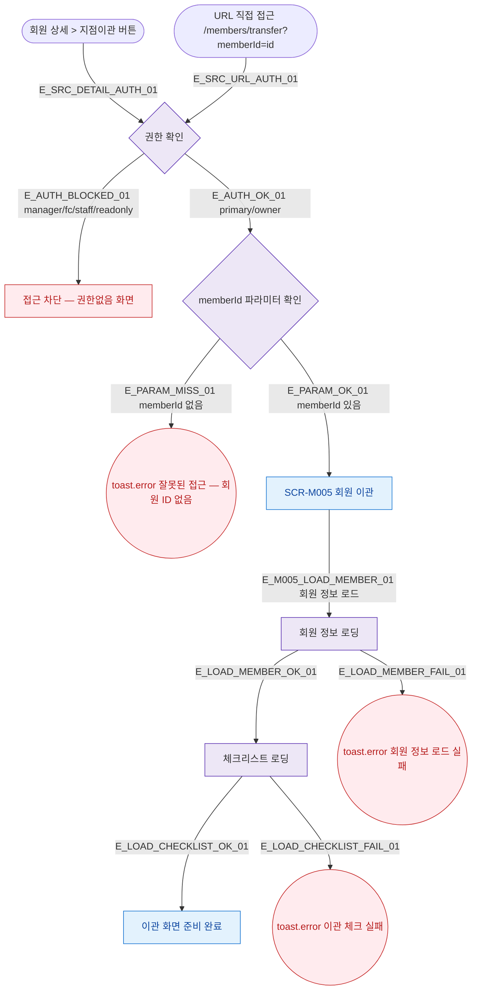

## 1. 목적

SCR-M005 회원 이관 화면에 진입할 수 있는 모든 경로를 명세한다.

## 2. 트리거/전제조건

- 사용자가 로그인 상태이다.
- primary 또는 owner 역할이다.

## 3. 다이어그램

## 4. 엣지 설명

| 엣지 ID | 출발 | 도착 | 조건 |
|---------|------|------|------|
| E_SRC_DETAIL_AUTH_01 | 회원 상세 지점이관 버튼 | 권한 확인 | 버튼 클릭 |
| E_SRC_URL_AUTH_01 | URL 직접 접근 | 권한 확인 | URL 진입 |
| E_AUTH_BLOCKED_01 | 권한 확인 | 접근 차단 | manager/fc/staff/readonly |
| E_AUTH_OK_01 | 권한 확인 | 파라미터 확인 | primary/owner |
| E_PARAM_MISS_01 | 파라미터 확인 | 토스트 에러 | memberId 없음 |
| E_PARAM_OK_01 | 파라미터 확인 | SCR-M005 | memberId 있음 |
| E_M005_LOAD_MEMBER_01 | SCR-M005 | 회원 정보 로딩 | 마운트 시 |
| E_LOAD_MEMBER_OK_01 | 회원 정보 로딩 | 체크리스트 로딩 | 정상 응답 |
| E_LOAD_MEMBER_FAIL_01 | 회원 정보 로딩 | 토스트 에러 | API 오류 |
| E_LOAD_CHECKLIST_OK_01 | 체크리스트 로딩 | 화면 준비 완료 | 정상 응답 |
| E_LOAD_CHECKLIST_FAIL_01 | 체크리스트 로딩 | 토스트 에러 | API 오류 |

## 5. TC 후보

| TC ID | 타입 | Given | When | Then |
|-------|------|-------|------|------|
| TC-M005-F1-01 | positive | owner 로그인, 회원 상세 | 지점이관 버튼 클릭 | SCR-M005 정상 진입 |
| TC-M005-F1-02 | positive | primary 로그인 | /members/transfer?memberId=1 URL 직접 접근 | SCR-M005 정상 진입 |
| TC-M005-F1-03 | negative | manager 로그인 | 지점이관 버튼 클릭 | 접근 차단 화면 |
| TC-M005-F1-04 | negative | owner 로그인 | /members/transfer (memberId 없음) | toast.error "잘못된 접근" |
| TC-M005-F1-05 | exception | owner 로그인 | 회원 정보 API 500 | toast.error 회원 정보 로드 실패 |
| TC-M005-F1-06 | exception | owner 로그인 | 체크리스트 API 500 | toast.error 이관 체크 실패 |
