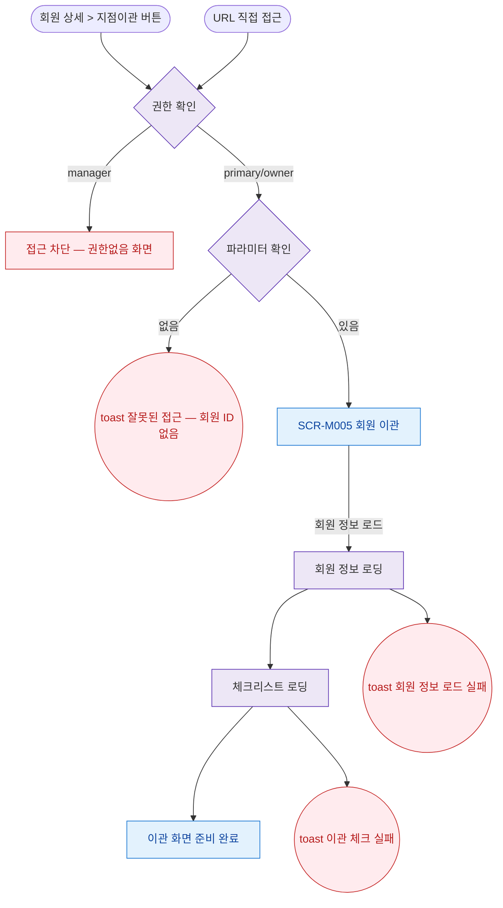

## 1. 목적

SCR-M005 회원 이관 화면에 진입할 수 있는 모든 경로를 명세한다.

## 2. 트리거/전제조건

- 사용자가 로그인 상태이다.
- primary 또는 owner 역할이다.

## 3. 다이어그램

## 4. 엣지 설명

| 출발 | 도착 | 조건 | |---------|------|------|------| | | 회원 상세 지점이관 버튼 | 권한 확인 | 버튼 클릭 | | | URL 직접 접근 | 권한 확인 | URL 진입 | | | 권한 확인 | 접근 차단 | manager | | | 권한 확인 | 파라미터 확인 | primary/owner | | | 파라미터 확인 | 토스트 에러 | 없음 | | | 파라미터 확인 | SCR-M005 | 있음 | | | SCR-M005 | 회원 정보 로딩 | 마운트 시 | | | 회원 정보 로딩 | 체크리스트 로딩 | 정상 응답 | | | 회원 정보 로딩 | 토스트 에러 | API 오류 | | | 체크리스트 로딩 | 화면 준비 완료 | 정상 응답 | | | 체크리스트 로딩 | 토스트 에러 | API 오류 |
