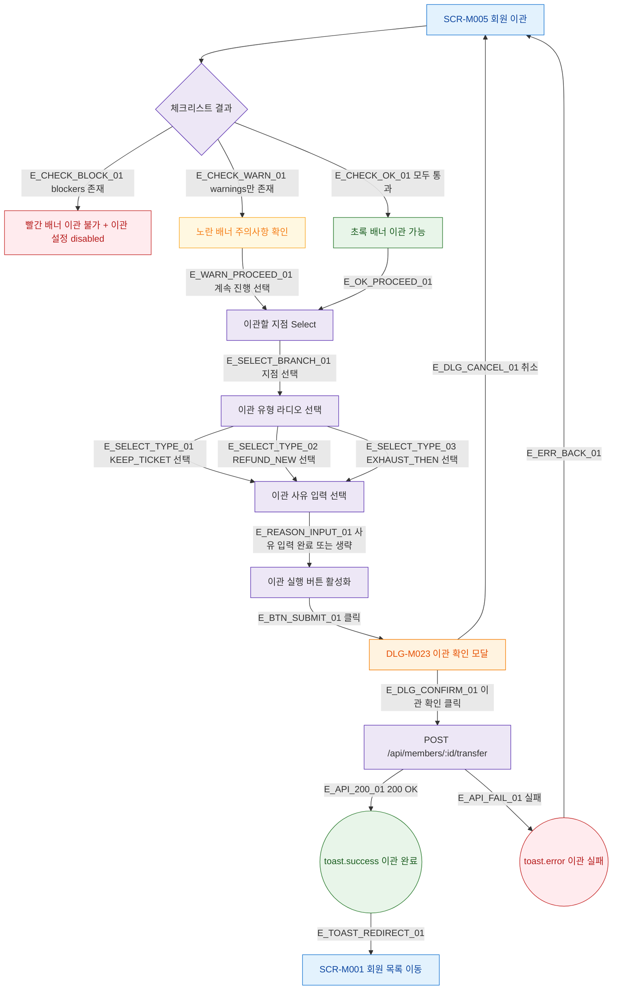

## 1. 목적

회원 이관의 정상 시나리오(Happy Path) 전체 흐름을 명세한다.

## 2. 트리거/전제조건

- SCR-M005 진입 완료
- 회원 정보 및 체크리스트 로드 완료

## 3. 다이어그램

## 4. 엣지 설명

| 엣지 ID | 출발 | 도착 | 조건 |
|---------|------|------|------|
| E_CHECK_BLOCK_01 | 체크리스트 결과 | 빨간 배너 | blockers > 0 |
| E_CHECK_WARN_01 | 체크리스트 결과 | 노란 배너 | blockers=0, warnings > 0 |
| E_CHECK_OK_01 | 체크리스트 결과 | 초록 배너 | 모두 통과 |
| E_WARN_PROCEED_01 | 노란 배너 | 지점 선택 | 계속 진행 |
| E_OK_PROCEED_01 | 초록 배너 | 지점 선택 | |
| E_SELECT_BRANCH_01 | 지점 선택 | 이관 유형 선택 | 지점 선택 완료 |
| E_SELECT_TYPE_01~03 | 이관 유형 선택 | 사유 입력 | 유형 선택 |
| E_REASON_INPUT_01 | 사유 입력 | 버튼 활성화 | |
| E_BTN_SUBMIT_01 | 이관 실행 버튼 | DLG-M023 | 클릭 |
| E_DLG_CANCEL_01 | DLG-M023 | SCR-M005 | 취소 |
| E_DLG_CONFIRM_01 | DLG-M023 | API | 이관 확인 |
| E_API_200_01 | API | toast.success | 200 OK |
| E_TOAST_REDIRECT_01 | toast.success | 회원 목록 | 자동 이동 |
| E_API_FAIL_01 | API | toast.error | 실패 |
| E_ERR_BACK_01 | toast.error | SCR-M005 | 폼 유지 |

## 5. TC 후보

| TC ID | 타입 | Given | When | Then |
|-------|------|-------|------|------|
| TC-M005-F2-01 | positive | 체크리스트 모두 통과 | 지점 선택 후 이관 실행 | 이관 성공, 회원 목록 이동 |
| TC-M005-F2-02 | positive | warnings만 존재 | 계속 진행 후 이관 실행 | 이관 성공 |
| TC-M005-F2-03 | negative | blockers 존재 | 이관 실행 버튼 클릭 시도 | 버튼 disabled, 이관 불가 |
| TC-M005-F2-04 | negative | 지점 미선택 | 이관 실행 버튼 클릭 시도 | 버튼 disabled |
| TC-M005-F2-05 | positive | 이관 확인 모달 | 취소 클릭 | 모달 닫기, SCR-M005 유지 |
| TC-M005-F2-06 | exception | API 500 | 이관 실행 | toast.error, 폼 유지 |
