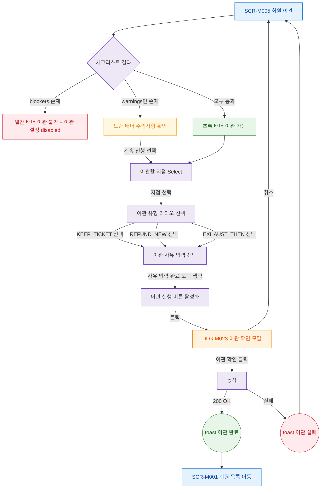

## 1. 목적

회원 이관의 정상 시나리오(Happy Path) 전체 흐름을 명세한다.

## 2. 트리거/전제조건

- SCR-M005 진입 완료
- 회원 정보 및 체크리스트 로드 완료

## 3. 다이어그램

## 4. 엣지 설명

| 출발 | 도착 | 조건 | |---------|------|------|------| | | 체크리스트 결과 | 빨간 배너 | blockers | | | 체크리스트 결과 | 노란 배너 | blockers=0, warnings | | | 체크리스트 결과 | 초록 배너 | 모두 통과 | | | 노란 배너 | 지점 선택 | 계속 진행 | | | 초록 배너 | 지점 선택 | |
| 지점 선택 | 이관 유형 선택 | 지점 선택 완료 | | ~03 | 이관 유형 선택 | 사유 입력 | 유형 선택 | | | 사유 입력 | 버튼 활성화 | |
| 이관 실행 버튼 | DLG-M023 | 클릭 | | | DLG-M023 | SCR-M005 | 취소 | | | DLG-M023 | API | 이관 확인 | | | API | toast | 200 OK | | | toast | 회원 목록 | 자동 이동 | | | API | toast | 실패 | | | toast | SCR-M005 | 폼 유지 |
