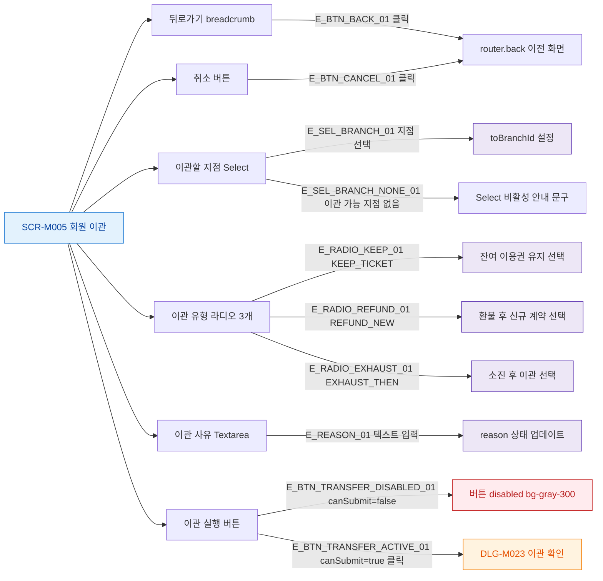

## 1. 목적

SCR-M005의 모든 버튼과 인터랙티브 요소의 동작을 명세한다.

## 2. 트리거/전제조건

- SCR-M005 화면 렌더링 완료

## 3. 다이어그램

## 4. 엣지 설명

| 엣지 ID | 출발 | 도착 | 조건 |
|---------|------|------|------|
| E_BTN_BACK_01 | 뒤로가기 | router.back | 클릭 |
| E_SEL_BRANCH_01 | 지점 Select | toBranchId 설정 | 선택 |
| E_SEL_BRANCH_NONE_01 | 지점 Select | 비활성 안내 | 이관 가능 지점 없음 |
| E_RADIO_KEEP_01 | 이관 유형 | KEEP_TICKET | 선택 |
| E_RADIO_REFUND_01 | 이관 유형 | REFUND_NEW | 선택 |
| E_RADIO_EXHAUST_01 | 이관 유형 | EXHAUST_THEN | 선택 |
| E_REASON_01 | 사유 Textarea | reason 업데이트 | 입력 |
| E_BTN_CANCEL_01 | 취소 버튼 | router.back | 클릭 |
| E_BTN_TRANSFER_DISABLED_01 | 이관 실행 버튼 | disabled | canSubmit=false |
| E_BTN_TRANSFER_ACTIVE_01 | 이관 실행 버튼 | DLG-M023 | canSubmit=true |

## 5. TC 후보

| TC ID | 타입 | Given | When | Then |
|-------|------|-------|------|------|
| TC-M005-F3-01 | positive | SCR-M005 | 뒤로가기 클릭 | 이전 화면 이동 |
| TC-M005-F3-02 | positive | SCR-M005 | 지점 선택 | toBranchId 설정, 버튼 활성화 진행 |
| TC-M005-F3-03 | positive | SCR-M005 | KEEP_TICKET 라디오 선택 | 유형 설정 |
| TC-M005-F3-04 | negative | canSubmit=false | 이관 실행 버튼 클릭 | disabled 상태, 동작 없음 |
| TC-M005-F3-05 | positive | canSubmit=true | 이관 실행 버튼 클릭 | DLG-M023 열림 |
| TC-M005-F3-06 | positive | 이관 가능 지점 없음 | 지점 Select 표시 | 비활성 + 안내 문구 |
