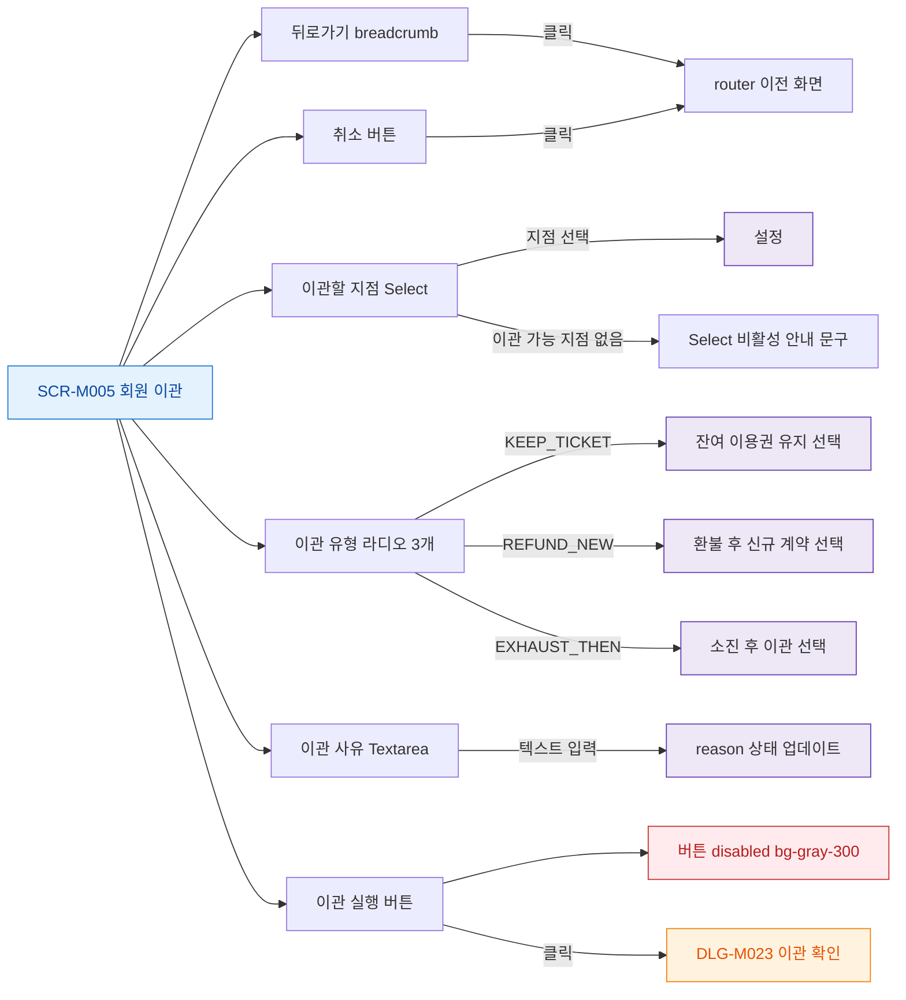

## 1. 목적

SCR-M005의 모든 버튼과 인터랙티브 요소의 동작을 명세한다.

## 2. 트리거/전제조건

- SCR-M005 화면 렌더링 완료

## 3. 다이어그램

## 4. 엣지 설명

| 출발 | 도착 | 조건 | |---------|------|------|------| | | 뒤로가기 | router | 클릭 | | | 지점 Select | 설정 | 선택 | | | 지점 Select | 비활성 안내 | 이관 가능 지점 없음 | | | 이관 유형 | KEEP_TICKET | 선택 | | | 이관 유형 | REFUND_NEW | 선택 | | | 이관 유형 | EXHAUST_THEN | 선택 | | | 사유 Textarea | reason 업데이트 | 입력 | | | 취소 버튼 | router | 클릭 | | | 이관 실행 버튼 | disabled | |
| 이관 실행 버튼 | DLG-M023 | |
