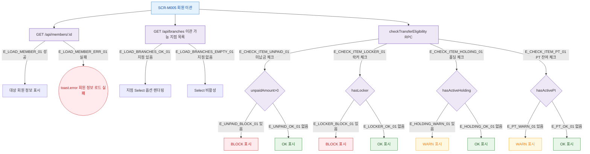

## 1. 목적

SCR-M005의 체크리스트 항목별 조회 로직 및 지점 목록 필터를 명세한다.

## 2. 트리거/전제조건

- SCR-M005 진입 완료, memberId 파라미터 유효

## 3. 다이어그램

## 4. 엣지 설명

| 엣지 ID | 출발 | 도착 | 조건 |
|---------|------|------|------|
| E_LOAD_MEMBER_01 | 회원 API | 회원 정보 표시 | 200 OK |
| E_LOAD_MEMBER_ERR_01 | 회원 API | toast.error | 실패 |
| E_LOAD_BRANCHES_OK_01 | 지점 API | 지점 Select | 지점 있음 |
| E_LOAD_BRANCHES_EMPTY_01 | 지점 API | Select 비활성 | 지점 없음 |
| E_UNPAID_BLOCK_01 | 미납금 확인 | BLOCK | unpaidAmount > 0 |
| E_LOCKER_BLOCK_01 | 락커 확인 | BLOCK | hasLocker=true |
| E_HOLDING_WARN_01 | 홀딩 확인 | WARN | hasActiveHolding=true |
| E_PT_WARN_01 | PT 확인 | WARN | hasActivePt=true |

## 5. TC 후보

| TC ID | 타입 | Given | When | Then |
|-------|------|-------|------|------|
| TC-M005-F4-01 | positive | 미납금 없음 | 체크리스트 로드 | 미납금 OK 표시 |
| TC-M005-F4-02 | negative | 미납금 있음 | 체크리스트 로드 | BLOCK 표시, 이관 불가 배너 |
| TC-M005-F4-03 | negative | 락커 있음 | 체크리스트 로드 | BLOCK 표시 |
| TC-M005-F4-04 | warning | 홀딩 중 | 체크리스트 로드 | WARN 표시, 노란 배너 |
| TC-M005-F4-05 | warning | PT 잔여 있음 | 체크리스트 로드 | WARN 표시 |
| TC-M005-F4-06 | positive | 이관 가능 지점 없음 | 화면 로드 | Select 비활성 |
