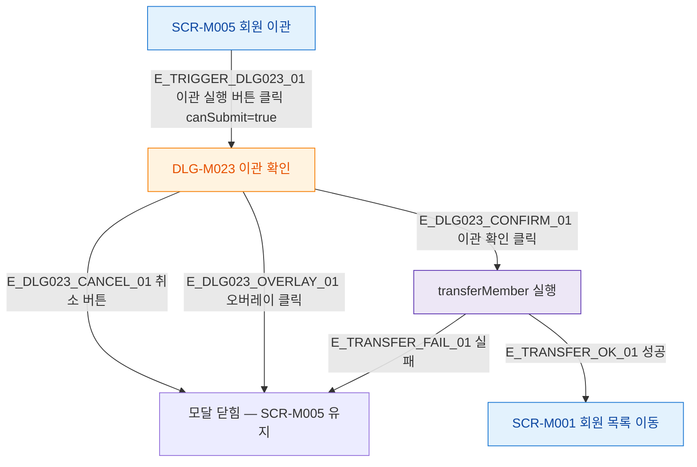

## 1. 목적

SCR-M005에서 열리는 모달의 트리거 경로를 명세한다.

## 2. 트리거/전제조건

- SCR-M005 화면 렌더링 완료

## 3. 다이어그램

## 4. 엣지 설명

| 엣지 ID | 출발 | 도착 | 조건 |
|---------|------|------|------|
| E_TRIGGER_DLG023_01 | 이관 실행 버튼 | DLG-M023 | canSubmit=true |
| E_DLG023_CANCEL_01 | DLG-M023 | 모달 닫힘 | 취소 버튼 |
| E_DLG023_OVERLAY_01 | DLG-M023 | 모달 닫힘 | 오버레이 클릭 |
| E_DLG023_CONFIRM_01 | DLG-M023 | transferMember | 이관 확인 |
| E_TRANSFER_OK_01 | transferMember | 회원 목록 이동 | 성공 |
| E_TRANSFER_FAIL_01 | transferMember | 모달 닫힘 | 실패 |

## 5. TC 후보

| TC ID | 타입 | Given | When | Then |
|-------|------|-------|------|------|
| TC-M005-F5-01 | positive | canSubmit=true | 이관 실행 버튼 클릭 | DLG-M023 열림 |
| TC-M005-F5-02 | negative | canSubmit=false | 이관 실행 버튼 클릭 | DLG-M023 열리지 않음 |
| TC-M005-F5-03 | positive | DLG-M023 열림 | 취소 클릭 | 모달 닫힘, SCR-M005 유지 |
| TC-M005-F5-04 | positive | DLG-M023 열림 | 오버레이 클릭 | 모달 닫힘 |
| TC-M005-F5-05 | positive | DLG-M023 열림 | 이관 확인 클릭 | 이관 실행 후 성공 시 회원 목록 이동 |
