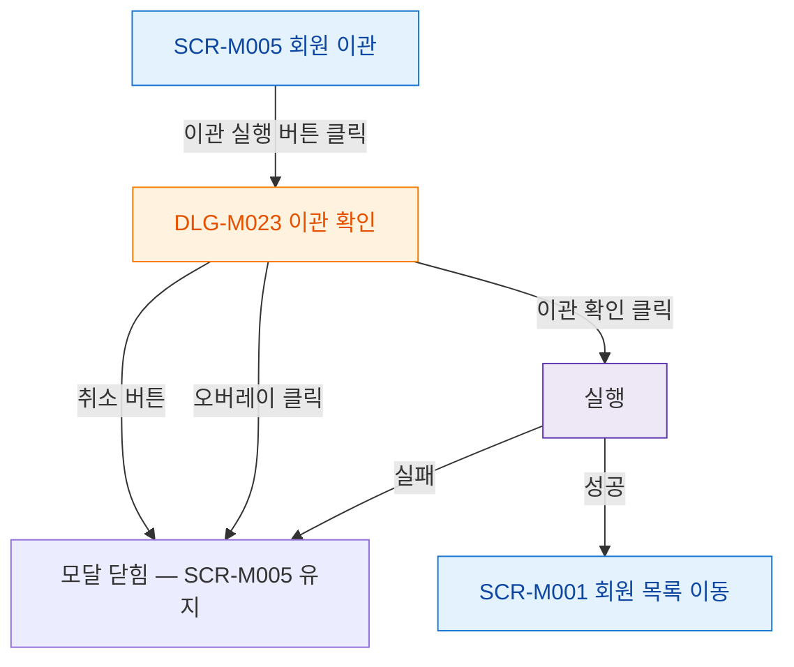

## 1. 목적

SCR-M005에서 열리는 모달의 트리거 경로를 명세한다.

## 2. 트리거/전제조건

- SCR-M005 화면 렌더링 완료

## 3. 다이어그램

## 4. 엣지 설명

| 출발 | 도착 | 조건 | |---------|------|------|------| | | 이관 실행 버튼 | DLG-M023 | |
| DLG-M023 | 모달 닫힘 | 취소 버튼 | | | DLG-M023 | 모달 닫힘 | 오버레이 클릭 | | | DLG-M023 | | 이관 확인 | | | | 회원 목록 이동 | 성공 | | | | 모달 닫힘 | 실패 |
