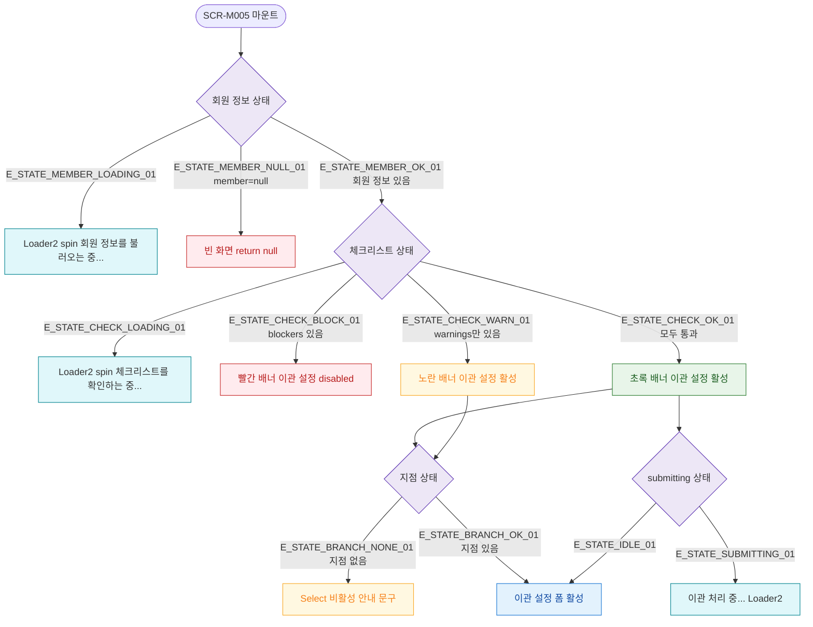

## 1. 목적

SCR-M005의 로딩/빈/에러/권한없음 등 UI 상태별 화면 분기를 명세한다.

## 2. 트리거/전제조건

- SCR-M005 마운트 시점

## 3. 다이어그램

## 4. 엣지 설명

| 엣지 ID | 출발 | 도착 | 조건 |
|---------|------|------|------|
| E_STATE_MEMBER_LOADING_01 | 회원 정보 상태 | 로딩 스피너 | fetch 중 |
| E_STATE_MEMBER_NULL_01 | 회원 정보 상태 | 빈 화면 | member=null |
| E_STATE_MEMBER_OK_01 | 회원 정보 상태 | 체크리스트 상태 | 회원 있음 |
| E_STATE_CHECK_LOADING_01 | 체크리스트 상태 | 로딩 스피너 | fetch 중 |
| E_STATE_CHECK_BLOCK_01 | 체크리스트 상태 | 빨간 배너 | blockers > 0 |
| E_STATE_CHECK_WARN_01 | 체크리스트 상태 | 노란 배너 | warnings만 존재 |
| E_STATE_CHECK_OK_01 | 체크리스트 상태 | 초록 배너 | 모두 통과 |
| E_STATE_BRANCH_NONE_01 | 지점 상태 | 비활성 안내 | 지점 없음 |
| E_STATE_SUBMITTING_01 | submitting 상태 | 처리 중 UI | submitting=true |

## 5. TC 후보

| TC ID | 타입 | Given | When | Then |
|-------|------|-------|------|------|
| TC-M005-F6-01 | positive | 정상 데이터 | 화면 마운트 | 로딩 → 체크리스트 → 폼 표시 |
| TC-M005-F6-02 | negative | member=null | 화면 마운트 | 빈 화면 |
| TC-M005-F6-03 | negative | blockers 있음 | 체크리스트 로드 | 빨간 배너, 이관 설정 disabled |
| TC-M005-F6-04 | warning | warnings만 있음 | 체크리스트 로드 | 노란 배너, 이관 설정 활성 |
| TC-M005-F6-05 | positive | 이관 처리 중 | submitting=true | 처리 중 스피너 표시 |
