## 1. 목적

SCR-M005에서 발생 가능한 에러 코드별 분기와 복구 경로를 명세한다.

## 2. 트리거/전제조건

- SCR-M005에서 API 호출 실패 발생 시

## 3. 다이어그램

```mermaid
flowchart TD
  SCR_M005[SCR-M005 회원 이관]

  SCR_M005 --> API_MEMBER[GET /api/members/:id]
  SCR_M005 --> API_CHECK[checkTransferEligibility]
  SCR_M005 --> API_TRANSFER[POST /api/members/:id/transfer]

  API_MEMBER -->|E_ERR_MEMBER_404_01 404| ERR_MEMBER_404[toast.error 회원을 찾을 수 없습니다]
  API_MEMBER -->|E_ERR_MEMBER_500_01 500| ERR_MEMBER_500[toast.error 회원 정보 로드 실패]
  API_MEMBER -->|E_ERR_MEMBER_TIMEOUT_01 타임아웃| ERR_TIMEOUT[toast.error 데이터 로드 오류]

  API_CHECK -->|E_ERR_CHECK_500_01 500| ERR_CHECK_500[toast.error 이관 체크 실패]
  API_CHECK -->|E_ERR_CHECK_EXCEPTION_01 예외| ERR_CHECK_EXC[toast.error 이관 체크 중 오류]

  API_TRANSFER -->|E_ERR_TRANSFER_400_01 400 유효성 오류| ERR_400[toast.error res.message]
  API_TRANSFER -->|E_ERR_TRANSFER_403_01 403 권한없음| ERR_403[toast.error 권한없음]
  API_TRANSFER -->|E_ERR_TRANSFER_500_01 500| ERR_500[toast.error 이관 실패]
  API_TRANSFER -->|E_ERR_TRANSFER_TIMEOUT_01 타임아웃| ERR_TIMEOUT2[toast.error 이관 처리 중 오류]
  API_TRANSFER -->|E_ERR_TRANSFER_EXCEPTION_01 예외| ERR_EXCEPTION[toast.error 이관 처리 중 오류]

  ERR_MEMBER_404 -->|E_RECOVER_404_01 뒤로가기| NAV_BACK[이전 화면]
  ERR_MEMBER_500 -->|E_RECOVER_500_01 재시도| SCR_M005
  ERR_CHECK_500  -->|E_RECOVER_CHECK_01 재시도| SCR_M005
  ERR_400        -->|E_RECOVER_400_01 폼 유지| SCR_M005
  ERR_500        -->|E_RECOVER_TRANS_01 폼 유지| SCR_M005

  classDef screen  fill:#E3F2FD,stroke:#1976D2,color:#0D47A1
  classDef error   fill:#FFEBEE,stroke:#C62828,color:#B71C1C
  classDef system  fill:#EDE7F6,stroke:#5E35B2

  class SCR_M005 screen
  class ERR_MEMBER_404,ERR_MEMBER_500,ERR_TIMEOUT,ERR_CHECK_500,ERR_CHECK_EXC,ERR_400,ERR_403,ERR_500,ERR_TIMEOUT2,ERR_EXCEPTION error
  class API_MEMBER,API_CHECK,API_TRANSFER system
```

## 4. 엣지 설명

| 엣지 ID | 출발 | 도착 | 조건 |
|---------|------|------|------|
| E_ERR_MEMBER_404_01 | 회원 API | toast.error | 404 Not Found |
| E_ERR_MEMBER_500_01 | 회원 API | toast.error | 500 Server Error |
| E_ERR_MEMBER_TIMEOUT_01 | 회원 API | toast.error | 타임아웃 |
| E_ERR_CHECK_500_01 | 체크 API | toast.error | 500 |
| E_ERR_TRANSFER_400_01 | 이관 API | toast.error | 400 유효성 오류 |
| E_ERR_TRANSFER_403_01 | 이관 API | toast.error | 403 권한없음 |
| E_ERR_TRANSFER_500_01 | 이관 API | toast.error | 500 |
| E_ERR_TRANSFER_TIMEOUT_01 | 이관 API | toast.error | 타임아웃 |

## 5. TC 후보

| TC ID | 타입 | Given | When | Then |
|-------|------|-------|------|------|
| TC-M005-F8-01 | negative | memberId 유효하지 않음 | 화면 마운트 | 404 toast.error |
| TC-M005-F8-02 | exception | 회원 API 500 | 화면 마운트 | toast.error, 재시도 가능 |
| TC-M005-F8-03 | exception | 체크리스트 API 500 | 화면 마운트 | toast.error 이관 체크 실패 |
| TC-M005-F8-04 | negative | 이관 API 400 | 이관 실행 | toast.error res.message, 폼 유지 |
| TC-M005-F8-05 | negative | 이관 API 403 | 이관 실행 | toast.error 권한없음 |
| TC-M005-F8-06 | exception | 이관 API 500 | 이관 실행 | toast.error 이관 실패, 폼 유지 |
| TC-M005-F8-07 | exception | 이관 API 타임아웃 | 이관 실행 | toast.error 처리 중 오류 |
