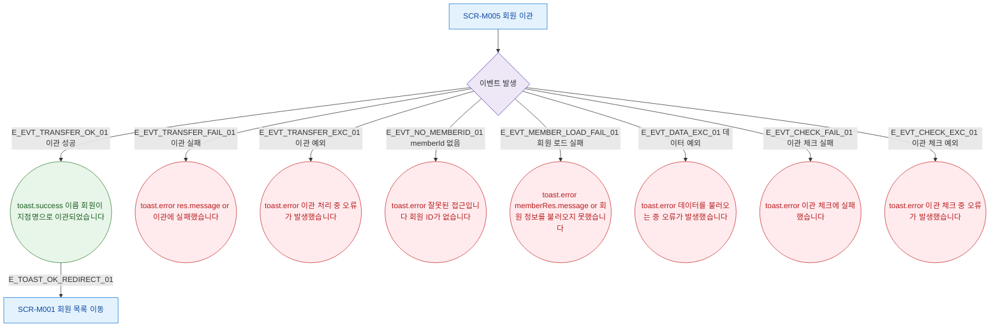

## 1. 목적

SCR-M005에서 발생하는 모든 토스트 메시지와 피드백 조건을 명세한다.

## 2. 트리거/전제조건

- SCR-M005 진입 후 각 액션 수행 시

## 3. 다이어그램

## 4. 엣지 설명

| 엣지 ID | 출발 | 도착 | 조건 |
|---------|------|------|------|
| E_EVT_TRANSFER_OK_01 | 이벤트 | toast.success | 이관 API 200 |
| E_EVT_TRANSFER_FAIL_01 | 이벤트 | toast.error | 이관 실패 |
| E_EVT_TRANSFER_EXC_01 | 이벤트 | toast.error | catch 예외 |
| E_EVT_NO_MEMBERID_01 | 이벤트 | toast.error | memberId 없음 |
| E_EVT_MEMBER_LOAD_FAIL_01 | 이벤트 | toast.error | 회원 로드 실패 |
| E_EVT_CHECK_FAIL_01 | 이벤트 | toast.error | 체크 API 실패 |
| E_TOAST_OK_REDIRECT_01 | toast.success | 회원 목록 | 자동 이동 |

## 5. TC 후보

| TC ID | 타입 | Given | When | Then |
|-------|------|-------|------|------|
| TC-M005-F9-01 | positive | 이관 성공 | 이관 확인 클릭 | toast.success "이관되었습니다", 회원 목록 이동 |
| TC-M005-F9-02 | negative | 이관 실패 | 이관 확인 클릭 | toast.error "이관에 실패했습니다" |
| TC-M005-F9-03 | negative | memberId 없음 | 화면 마운트 | toast.error "잘못된 접근" |
| TC-M005-F9-04 | exception | 회원 로드 실패 | 화면 마운트 | toast.error "회원 정보를 불러오지 못했습니다" |
| TC-M005-F9-05 | exception | 체크 API 실패 | 화면 마운트 | toast.error "이관 체크에 실패했습니다" |
| TC-M005-F9-06 | exception | 예외 발생 | 이관 실행 | toast.error "이관 처리 중 오류" |
