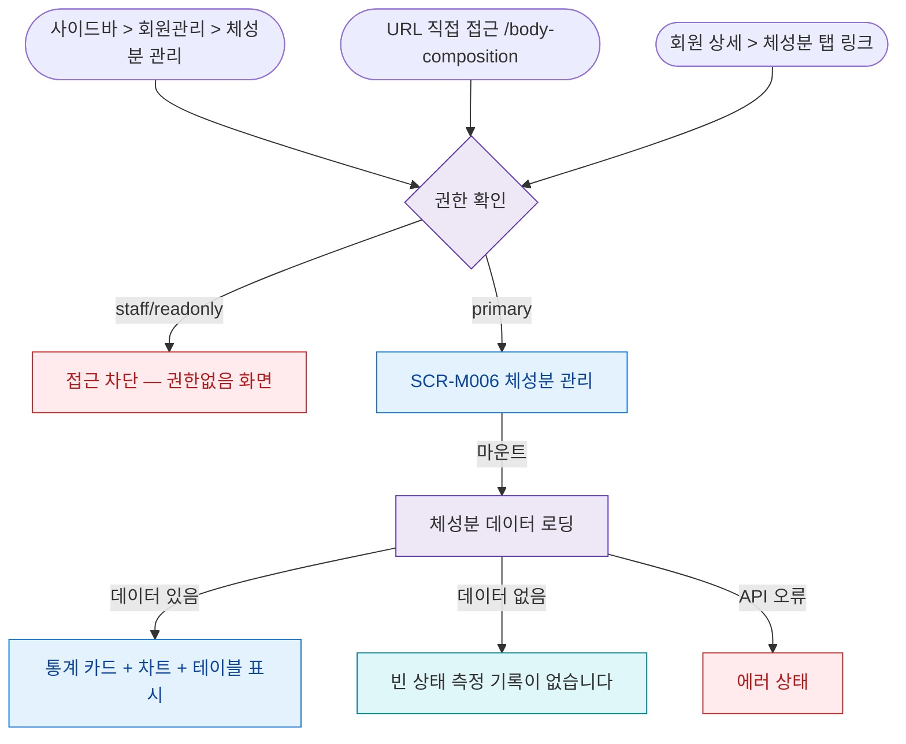

## 1. 목적

SCR-M006 체성분 관리 화면에 진입할 수 있는 모든 경로를 명세한다.

## 2. 트리거/전제조건

- 사용자가 로그인 상태이다.

## 3. 다이어그램

## 4. 엣지 설명

| 출발 | 도착 | 조건 | |---------|------|------|------| | | 사이드바 | 권한 확인 | 메뉴 클릭 | | | URL | 권한 확인 | 직접 접근 | | | 회원 상세 탭 | 권한 확인 | 탭 클릭 | | | 권한 확인 | 접근 차단 | staff/readonly | | | 권한 확인 | SCR-M006 | primary | | | 로딩 | 표시 | 데이터 있음 | | | 로딩 | 빈 상태 | 0건 | | | 로딩 | 에러 | API 오류 |
