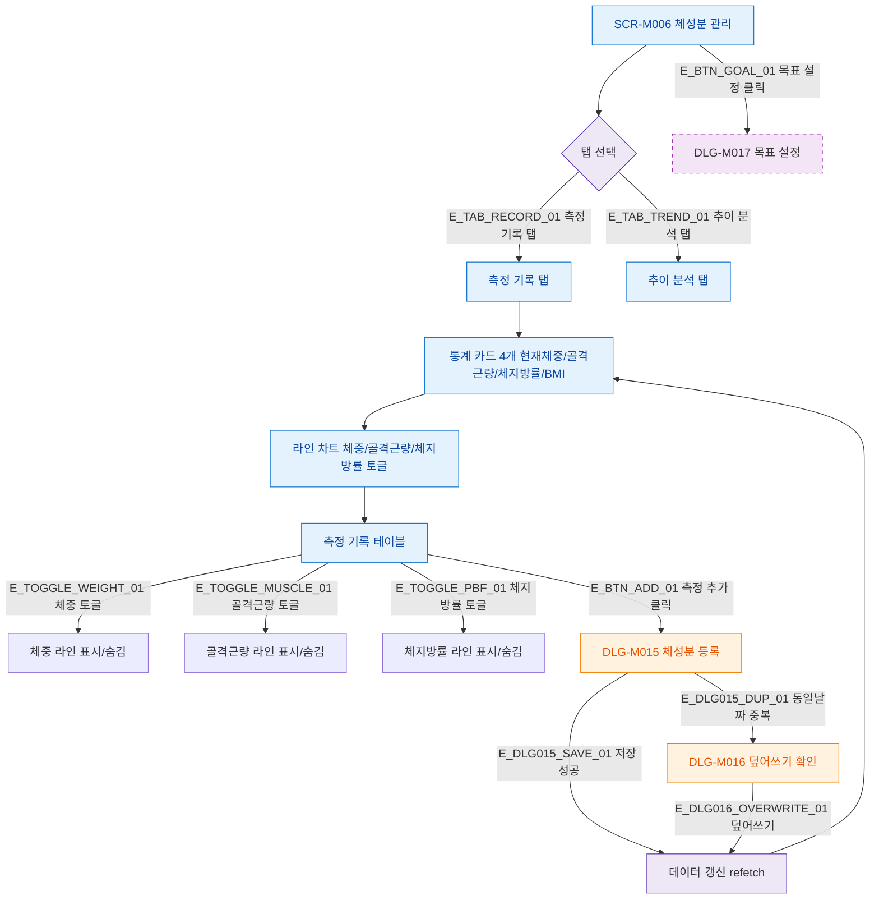

## 1. 목적

SCR-M006의 정상 시나리오 Happy Path를 명세한다.

## 2. 트리거/전제조건

- SCR-M006 진입 완료

## 3. 다이어그램

## 4. 엣지 설명

| 엣지 ID | 출발 | 도착 | 조건 |
|---------|------|------|------|
| E_TAB_RECORD_01 | 탭 선택 | 측정 기록 탭 | 클릭 |
| E_TAB_TREND_01 | 탭 선택 | 추이 분석 탭 | 클릭 |
| E_BTN_ADD_01 | 테이블 | DLG-M015 | 측정 추가 클릭 |
| E_DLG015_SAVE_01 | DLG-M015 | 데이터 갱신 | 저장 성공 |
| E_DLG015_DUP_01 | DLG-M015 | DLG-M016 | 동일 날짜 중복 |
| E_DLG016_OVERWRITE_01 | DLG-M016 | 데이터 갱신 | 덮어쓰기 선택 |
| E_BTN_GOAL_01 | SCR-M006 | DLG-M017 | 목표 설정 클릭 (🆕) |

## 5. TC 후보

| TC ID | 타입 | Given | When | Then |
|-------|------|-------|------|------|
| TC-M006-F2-01 | positive | 측정 데이터 2건+ | 화면 로드 | 통계 카드 + 차트 + 테이블 표시 |
| TC-M006-F2-02 | positive | 측정 기록 탭 | 측정 추가 클릭 | DLG-M015 열림 |
| TC-M006-F2-03 | positive | DLG-M015 | 저장 성공 | 데이터 갱신, 테이블 업데이트 |
| TC-M006-F2-04 | negative | 동일 날짜 데이터 존재 | 저장 시도 | DLG-M016 덮어쓰기 확인 |
| TC-M006-F2-05 | positive | 차트 표시 중 | 골격근량 토글 | 해당 라인 숨김/표시 |
| TC-M006-F2-06 | positive | 데이터 1건 | 화면 로드 | 통계 카드만, 차트 미표시 |
