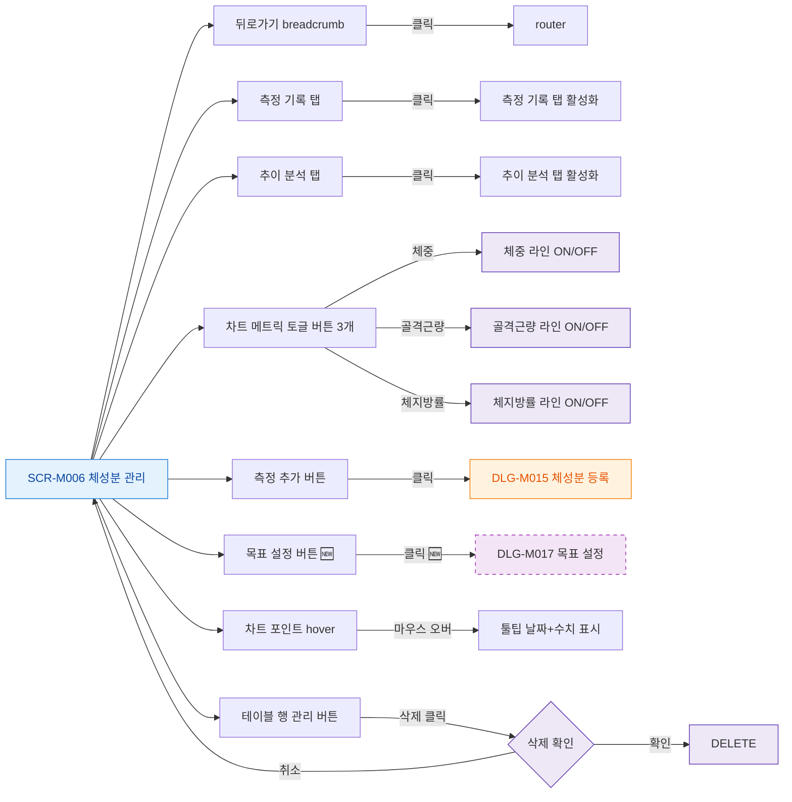

## 1. 목적

SCR-M006의 모든 버튼과 인터랙티브 요소 동작을 명세한다.

## 2. 트리거/전제조건

- SCR-M006 화면 렌더링 완료

## 3. 다이어그램

## 4. 엣지 설명

| 출발 | 도착 | 조건 | |---------|------|------|------| | | 뒤로가기 | router | 클릭 | | | 측정 기록 탭 | 탭 활성화 | 클릭 | | | 추이 분석 탭 | 탭 활성화 | 클릭 | | | 체중 토글 | 라인 ON/OFF | 클릭 | | | 측정 추가 | DLG-M015 | 클릭 | | | 목표 설정 | DLG-M017 | 클릭 (🆕) | | | 차트 포인트 | 툴팁 | hover | | | 테이블 삭제 | 삭제 확인 | 클릭 |
