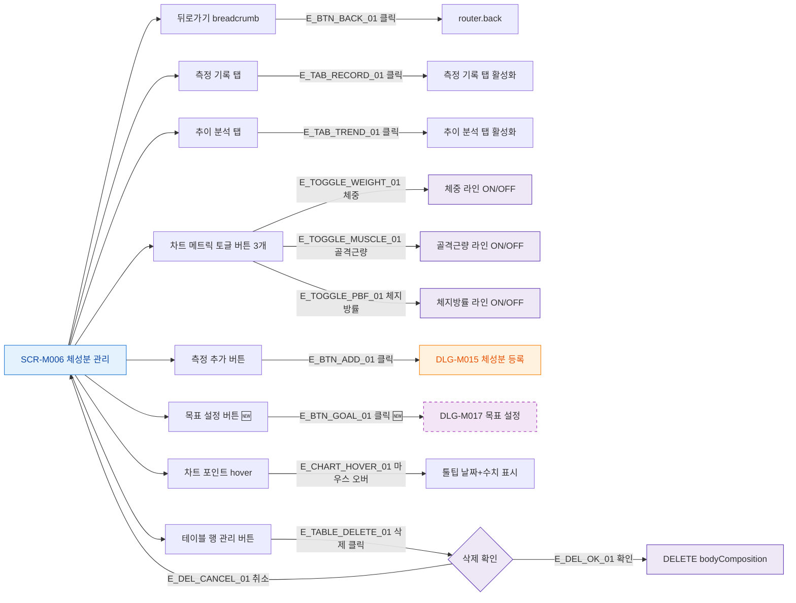

## 1. 목적

SCR-M006의 모든 버튼과 인터랙티브 요소 동작을 명세한다.

## 2. 트리거/전제조건

- SCR-M006 화면 렌더링 완료

## 3. 다이어그램

## 4. 엣지 설명

| 엣지 ID | 출발 | 도착 | 조건 |
|---------|------|------|------|
| E_BTN_BACK_01 | 뒤로가기 | router.back | 클릭 |
| E_TAB_RECORD_01 | 측정 기록 탭 | 탭 활성화 | 클릭 |
| E_TAB_TREND_01 | 추이 분석 탭 | 탭 활성화 | 클릭 |
| E_TOGGLE_WEIGHT_01 | 체중 토글 | 라인 ON/OFF | 클릭 |
| E_BTN_ADD_01 | 측정 추가 | DLG-M015 | 클릭 |
| E_BTN_GOAL_01 | 목표 설정 | DLG-M017 | 클릭 (🆕) |
| E_CHART_HOVER_01 | 차트 포인트 | 툴팁 | hover |
| E_TABLE_DELETE_01 | 테이블 삭제 | 삭제 확인 | 클릭 |

## 5. TC 후보

| TC ID | 타입 | Given | When | Then |
|-------|------|-------|------|------|
| TC-M006-F3-01 | positive | SCR-M006 | 측정 추가 클릭 | DLG-M015 열림 |
| TC-M006-F3-02 | positive | 차트 표시 | 체중 토글 클릭 | 체중 라인 숨김 |
| TC-M006-F3-03 | positive | 차트 포인트 | hover | 툴팁 표시 |
| TC-M006-F3-04 | positive | 테이블 행 | 삭제 클릭 후 확인 | 데이터 삭제, 갱신 |
| TC-M006-F3-05 | positive | 테이블 행 | 삭제 클릭 후 취소 | 삭제 취소 |
