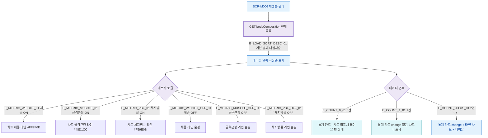

## 1. 목적

SCR-M006의 차트 메트릭 토글, 테이블 정렬, 데이터 조회 조건을 명세한다.

## 2. 트리거/전제조건

- SCR-M006 데이터 로드 완료

## 3. 다이어그램

## 4. 엣지 설명

| 엣지 ID | 출발 | 도착 | 조건 |
|---------|------|------|------|
| E_LOAD_SORT_DESC_01 | 데이터 로드 | 테이블 정렬 | 기본 날짜 내림차순 |
| E_METRIC_WEIGHT_01 | 메트릭 토글 | 체중 라인 표시 | 체중 ON |
| E_METRIC_MUSCLE_01 | 메트릭 토글 | 골격근량 라인 표시 | 골격근량 ON |
| E_METRIC_PBF_01 | 메트릭 토글 | 체지방률 라인 표시 | 체지방률 ON |
| E_COUNT_0_01 | 데이터 건수 | 빈 상태 | 0건 |
| E_COUNT_1_01 | 데이터 건수 | 1건 UI | 1건 |
| E_COUNT_2PLUS_01 | 데이터 건수 | 전체 UI | 2건+ |

## 5. TC 후보

| TC ID | 타입 | Given | When | Then |
|-------|------|-------|------|------|
| TC-M006-F4-01 | positive | 데이터 0건 | 화면 로드 | 통계 카드 "-", 차트 미표시 |
| TC-M006-F4-02 | positive | 데이터 1건 | 화면 로드 | 통계 카드 표시, 차트 미표시 |
| TC-M006-F4-03 | positive | 데이터 2건+ | 화면 로드 | 통계 카드 + 차트 + 테이블 |
| TC-M006-F4-04 | positive | 차트 표시 중 | 체중 토글 OFF | 체중 라인 숨김 |
| TC-M006-F4-05 | positive | 차트 표시 중 | 골격근량 토글 ON | 골격근량 라인 표시 |
