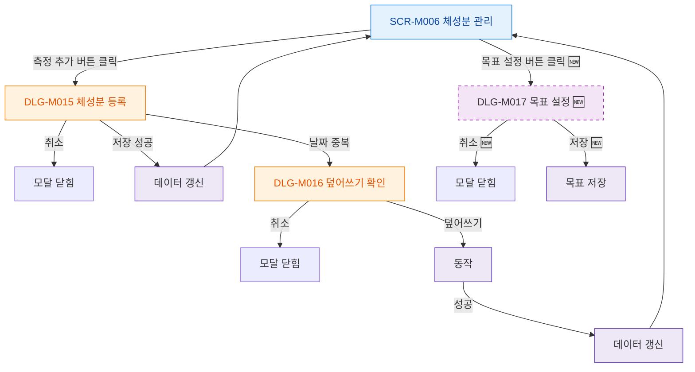

## 1. 목적

SCR-M006에서 열리는 모든 모달의 트리거 경로를 명세한다.

## 2. 트리거/전제조건

- SCR-M006 렌더링 완료

## 3. 다이어그램

## 4. 엣지 설명

| 출발 | 도착 | 조건 | |---------|------|------|------| | | SCR-M006 | DLG-M015 | 측정 추가 클릭 | | | SCR-M006 | DLG-M017 | 목표 설정 클릭 (🆕) | | | DLG-M015 | DLG-M016 | 동일 날짜 중복 | | | DLG-M016 | API | 덮어쓰기 확인 | | | DLG-M015 | 데이터 갱신 | 저장 성공 |
