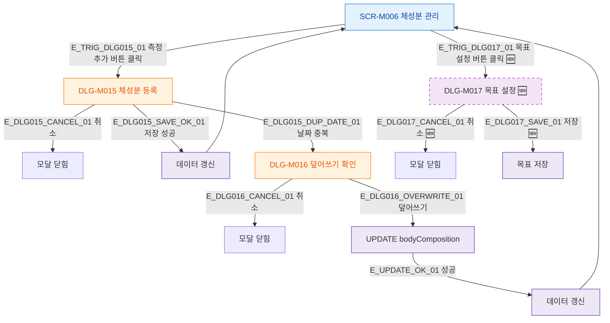

## 1. 목적

SCR-M006에서 열리는 모든 모달의 트리거 경로를 명세한다.

## 2. 트리거/전제조건

- SCR-M006 렌더링 완료

## 3. 다이어그램

## 4. 엣지 설명

| 엣지 ID | 출발 | 도착 | 조건 |
|---------|------|------|------|
| E_TRIG_DLG015_01 | SCR-M006 | DLG-M015 | 측정 추가 클릭 |
| E_TRIG_DLG017_01 | SCR-M006 | DLG-M017 | 목표 설정 클릭 (🆕) |
| E_DLG015_DUP_DATE_01 | DLG-M015 | DLG-M016 | 동일 날짜 중복 |
| E_DLG016_OVERWRITE_01 | DLG-M016 | UPDATE API | 덮어쓰기 확인 |
| E_DLG015_SAVE_OK_01 | DLG-M015 | 데이터 갱신 | 저장 성공 |

## 5. TC 후보

| TC ID | 타입 | Given | When | Then |
|-------|------|-------|------|------|
| TC-M006-F5-01 | positive | SCR-M006 | 측정 추가 클릭 | DLG-M015 열림 |
| TC-M006-F5-02 | positive | DLG-M015 | 저장 성공 | 모달 닫힘, 데이터 갱신 |
| TC-M006-F5-03 | negative | 동일 날짜 데이터 존재 | 저장 시도 | DLG-M016 열림 |
| TC-M006-F5-04 | positive | DLG-M016 | 덮어쓰기 선택 | 기존 데이터 업데이트, 갱신 |
| TC-M006-F5-05 | positive | DLG-M016 | 취소 | 모달 닫힘, 원본 유지 |
