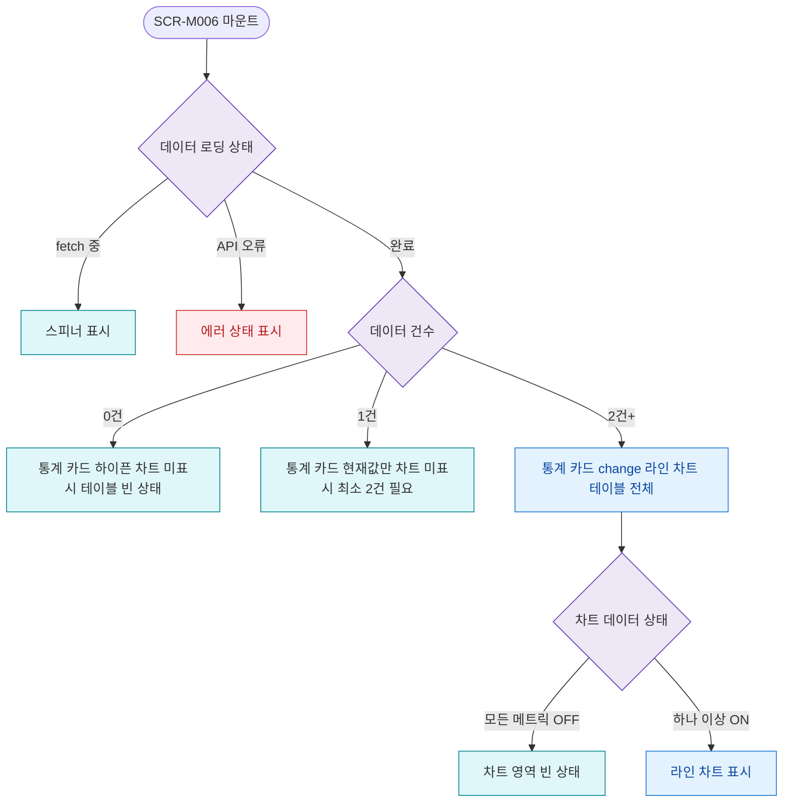

## 1. 목적

SCR-M006의 데이터 건수 및 로딩/에러 상태별 UI 분기를 명세한다.

## 2. 트리거/전제조건

- SCR-M006 마운트 시점

## 3. 다이어그램

## 4. 엣지 설명

| 출발 | 도착 | 조건 | |---------|------|------|------| | | 로딩 상태 | 스피너 | fetch 중 | | | 로딩 상태 | 에러 | API 오류 | | | 로딩 상태 | 데이터 건수 분기 | 완료 | | | 데이터 건수 | 빈 상태 | 0건 | | | 데이터 건수 | 1건 UI | 1건 | | | 데이터 건수 | 전체 UI | 2건+ | | | 차트 상태 | 차트 빈 상태 | 모든 메트릭 OFF |
