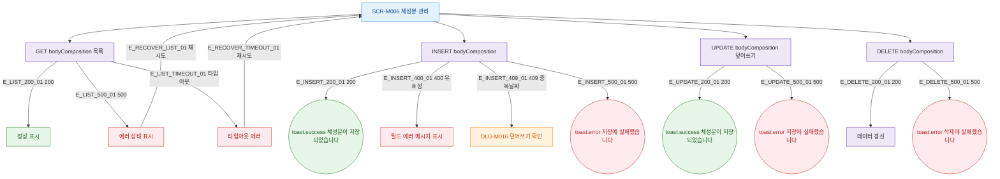

## 1. 목적

SCR-M006에서 발생 가능한 에러 코드별 분기와 복구 경로를 명세한다.

## 2. 트리거/전제조건

- SCR-M006에서 API 호출 실패 발생 시

## 3. 다이어그램

## 4. 엣지 설명

| 엣지 ID | 출발 | 도착 | 조건 |
|---------|------|------|------|
| E_LIST_500_01 | 목록 API | 에러 상태 | 500 |
| E_INSERT_400_01 | 등록 API | 필드 에러 | 400 유효성 오류 |
| E_INSERT_409_01 | 등록 API | DLG-M016 | 409 날짜 중복 |
| E_INSERT_500_01 | 등록 API | toast.error | 500 |
| E_UPDATE_500_01 | 덮어쓰기 API | toast.error | 500 |
| E_DELETE_500_01 | 삭제 API | toast.error | 500 |

## 5. TC 후보

| TC ID | 타입 | Given | When | Then |
|-------|------|-------|------|------|
| TC-M006-F8-01 | exception | 목록 API 500 | 화면 로드 | 에러 상태, 재시도 가능 |
| TC-M006-F8-02 | negative | 유효성 오류 | 체성분 저장 | 필드 에러 메시지 |
| TC-M006-F8-03 | negative | 동일 날짜 중복 | 체성분 저장 | DLG-M016 열림 |
| TC-M006-F8-04 | exception | 등록 API 500 | 체성분 저장 | toast.error |
| TC-M006-F8-05 | exception | 삭제 API 500 | 행 삭제 시도 | toast.error |
