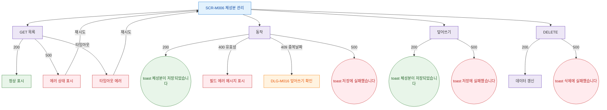

## 1. 목적

SCR-M006에서 발생 가능한 에러 코드별 분기와 복구 경로를 명세한다.

## 2. 트리거/전제조건

- SCR-M006에서 API 호출 실패 발생 시

## 3. 다이어그램

## 4. 엣지 설명

| 출발 | 도착 | 조건 | |---------|------|------|------| | | 목록 API | 에러 상태 | 500 | | | 등록 API | 필드 에러 | 400 유효성 오류 | | | 등록 API | DLG-M016 | 409 날짜 중복 | | | 등록 API | toast | 500 | | | 덮어쓰기 API | toast | 500 | | | 삭제 API | toast | 500 |
