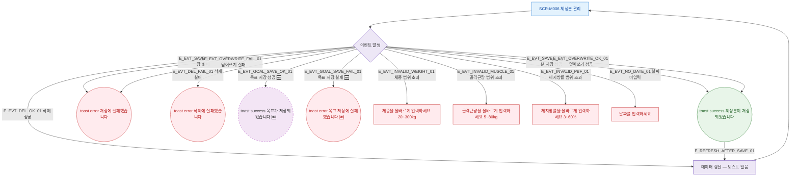

## 1. 목적

SCR-M006에서 발생하는 모든 토스트 메시지와 피드백 조건을 명세한다.

## 2. 트리거/전제조건

- SCR-M006에서 각 액션 수행 시

## 3. 다이어그램

## 4. 엣지 설명

| 엣지 ID | 출발 | 도착 | 조건 |
|---------|------|------|------|
| E_EVT_SAVE_OK_01 | 이벤트 | toast.success | 체성분 저장 성공 |
| E_EVT_SAVE_FAIL_01 | 이벤트 | toast.error | 저장 실패 |
| E_EVT_DEL_FAIL_01 | 이벤트 | toast.error | 삭제 실패 |
| E_EVT_INVALID_WEIGHT_01 | 이벤트 | 필드 에러 | 체중 범위 오류 |
| E_EVT_INVALID_MUSCLE_01 | 이벤트 | 필드 에러 | 골격근량 범위 오류 |
| E_EVT_INVALID_PBF_01 | 이벤트 | 필드 에러 | 체지방률 범위 오류 |
| E_EVT_NO_DATE_01 | 이벤트 | 필드 에러 | 날짜 미입력 |

## 5. TC 후보

| TC ID | 타입 | Given | When | Then |
|-------|------|-------|------|------|
| TC-M006-F9-01 | positive | 유효 데이터 | 저장 성공 | toast.success, 데이터 갱신 |
| TC-M006-F9-02 | negative | 저장 API 실패 | 저장 시도 | toast.error |
| TC-M006-F9-03 | negative | 체중 300 초과 | 저장 시도 | 필드 에러 메시지 |
| TC-M006-F9-04 | negative | 날짜 미입력 | 저장 시도 | 필드 에러 |
| TC-M006-F9-05 | exception | 삭제 API 실패 | 행 삭제 | toast.error |
