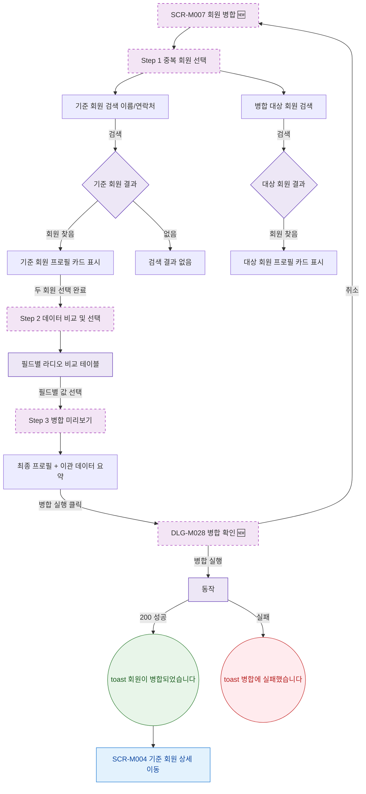

## 1. 목적

SCR-M007 회원 병합의 3단계 Happy Path를 명세한다. 🆕 미구현 기능.

## 2. 트리거/전제조건

- SCR-M007 진입 완료

## 3. 다이어그램

## 4. 엣지 설명

| 출발 | 도착 | 조건 | |---------|------|------|------| | | 기준 회원 검색 | 결과 분기 | 검색어 입력 후 | | | 기준 회원 카드 | Step 2 | 두 회원 모두 선택 | | | 병합 미리보기 | DLG-M028 | 병합 실행 클릭 | | | DLG-M028 | merge API | 병합 실행 | | | merge API | toast | 200 OK | | | toast | 기준 회원 상세 | 자동 이동 | | | merge API | toast | 실패 |
