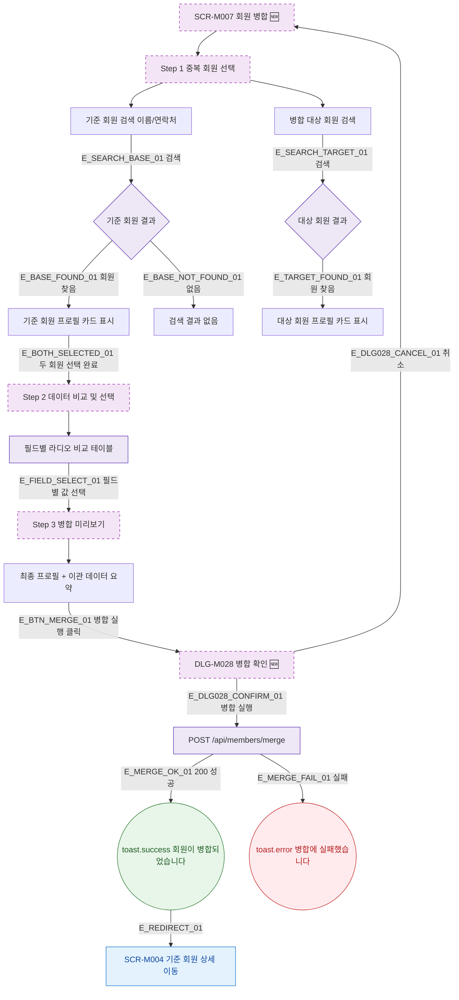

## 1. 목적

SCR-M007 회원 병합의 3단계 Happy Path를 명세한다. 🆕 미구현 기능.

## 2. 트리거/전제조건

- SCR-M007 진입 완료

## 3. 다이어그램

## 4. 엣지 설명

| 엣지 ID | 출발 | 도착 | 조건 |
|---------|------|------|------|
| E_SEARCH_BASE_01 | 기준 회원 검색 | 결과 분기 | 검색어 입력 후 |
| E_BOTH_SELECTED_01 | 기준 회원 카드 | Step 2 | 두 회원 모두 선택 |
| E_BTN_MERGE_01 | 병합 미리보기 | DLG-M028 | 병합 실행 클릭 |
| E_DLG028_CONFIRM_01 | DLG-M028 | merge API | 병합 실행 |
| E_MERGE_OK_01 | merge API | toast.success | 200 OK |
| E_REDIRECT_01 | toast.success | 기준 회원 상세 | 자동 이동 |
| E_MERGE_FAIL_01 | merge API | toast.error | 실패 |

## 5. TC 후보

| TC ID | 타입 | Given | When | Then |
|-------|------|-------|------|------|
| TC-M007-F2-01 | positive | 두 회원 선택 완료 | 병합 실행 후 확인 | 병합 성공, 기준 회원 상세 이동 |
| TC-M007-F2-02 | negative | 기준 회원 미선택 | 병합 실행 클릭 | 버튼 disabled |
| TC-M007-F2-03 | positive | DLG-M028 열림 | 취소 클릭 | SCR-M007 유지 |
| TC-M007-F2-04 | exception | merge API 500 | 병합 실행 | toast.error |
