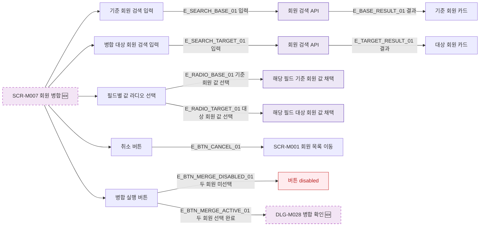

## 1. 목적

SCR-M007의 모든 버튼과 인터랙티브 요소 동작을 명세한다. 🆕 미구현 기능.

## 2. 트리거/전제조건

- SCR-M007 렌더링 완료

## 3. 다이어그램

## 4. 엣지 설명

| 엣지 ID | 출발 | 도착 | 조건 |
|---------|------|------|------|
| E_SEARCH_BASE_01 | 기준 회원 검색 | 검색 API | 입력 |
| E_SEARCH_TARGET_01 | 대상 회원 검색 | 검색 API | 입력 |
| E_BTN_CANCEL_01 | 취소 버튼 | 회원 목록 | 클릭 |
| E_BTN_MERGE_DISABLED_01 | 병합 실행 | disabled | 두 회원 미선택 |
| E_BTN_MERGE_ACTIVE_01 | 병합 실행 | DLG-M028 | 두 회원 선택 완료 |

## 5. TC 후보

| TC ID | 타입 | Given | When | Then |
|-------|------|-------|------|------|
| TC-M007-F3-01 | positive | SCR-M007 | 기준 회원 검색 | 회원 카드 표시 |
| TC-M007-F3-02 | negative | 두 회원 미선택 | 병합 실행 클릭 | 버튼 disabled |
| TC-M007-F3-03 | positive | 두 회원 선택 | 병합 실행 클릭 | DLG-M028 열림 |
| TC-M007-F3-04 | positive | SCR-M007 | 취소 클릭 | 회원 목록 이동 |
