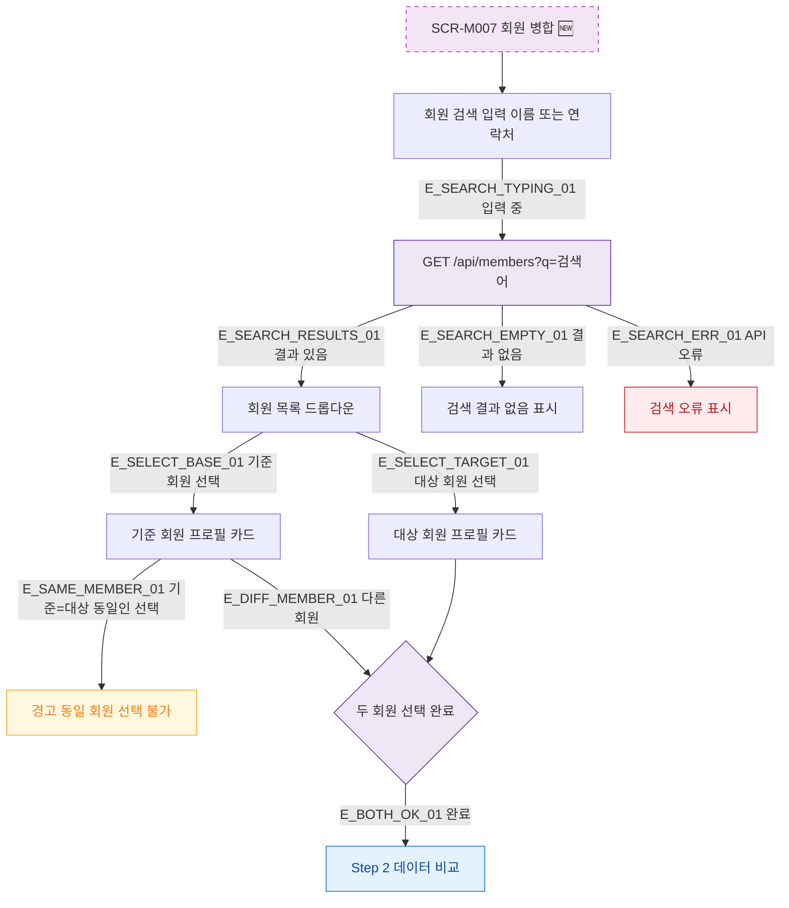

## 1. 목적

SCR-M007의 회원 검색 기능 흐름을 명세한다. 🆕 미구현 기능.

## 2. 트리거/전제조건

- SCR-M007 Step 1 활성화

## 3. 다이어그램

## 4. 엣지 설명

| 엣지 ID | 출발 | 도착 | 조건 |
|---------|------|------|------|
| E_SEARCH_TYPING_01 | 검색 입력 | 검색 API | 입력 이벤트 |
| E_SEARCH_RESULTS_01 | 검색 API | 결과 목록 | 결과 있음 |
| E_SEARCH_EMPTY_01 | 검색 API | 빈 상태 | 결과 없음 |
| E_SELECT_BASE_01 | 결과 목록 | 기준 회원 카드 | 선택 |
| E_SAME_MEMBER_01 | 기준 회원 카드 | 경고 | 동일 회원 |
| E_BOTH_OK_01 | 두 회원 완료 | Step 2 | 완료 |

## 5. TC 후보

| TC ID | 타입 | Given | When | Then |
|-------|------|-------|------|------|
| TC-M007-F4-01 | positive | 검색어 입력 | 이름 검색 | 회원 목록 드롭다운 |
| TC-M007-F4-02 | positive | 검색 결과 없음 | 검색 | 결과 없음 표시 |
| TC-M007-F4-03 | negative | 동일 회원 선택 | 기준=대상 | 경고 표시 |
| TC-M007-F4-04 | positive | 두 회원 선택 | 선택 완료 | Step 2 활성화 |
