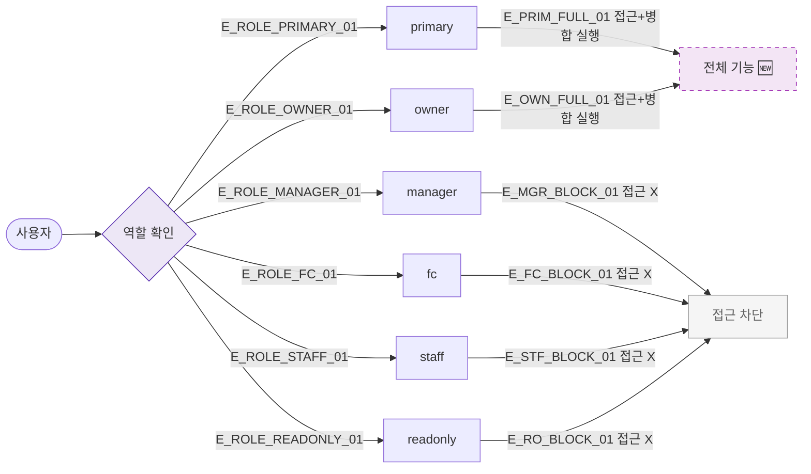

## 1. 목적

SCR-M007에서 역할별 접근 및 액션 가능 범위를 명세한다. 🆕 미구현 기능.

## 2. 트리거/전제조건

- 사용자가 로그인 상태이다.

## 3. 다이어그램

## 4. 엣지 설명

| 엣지 ID | 출발 | 도착 | 조건 |
|---------|------|------|------|
| E_PRIM_FULL_01 | primary | 전체 기능 | 접근 허용 |
| E_OWN_FULL_01 | owner | 전체 기능 | 접근 허용 |
| E_MGR_BLOCK_01 | manager | 접근 차단 | 권한 없음 |
| E_FC_BLOCK_01 | fc | 접근 차단 | 권한 없음 |
| E_STF_BLOCK_01 | staff | 접근 차단 | 권한 없음 |
| E_RO_BLOCK_01 | readonly | 접근 차단 | 권한 없음 |

## 5. TC 후보

| TC ID | 타입 | Given | When | Then |
|-------|------|-------|------|------|
| TC-M007-F7-01 | positive | primary | SCR-M007 접근 | 전체 기능 |
| TC-M007-F7-02 | positive | owner | SCR-M007 접근 | 전체 기능 |
| TC-M007-F7-03 | negative | manager | SCR-M007 접근 | 접근 차단 |
| TC-M007-F7-04 | negative | fc | SCR-M007 접근 | 접근 차단 |
| TC-M007-F7-05 | negative | staff | SCR-M007 접근 | 접근 차단 |
| TC-M007-F7-06 | negative | readonly | SCR-M007 접근 | 접근 차단 |
