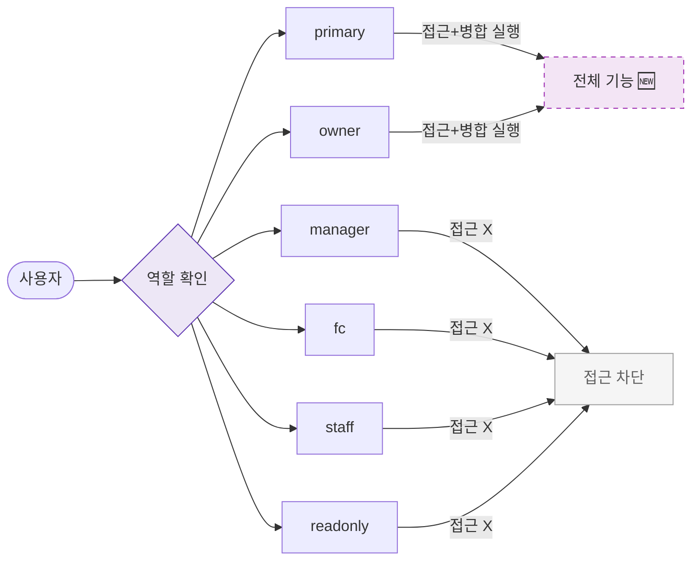

## 1. 목적

SCR-M007에서 역할별 접근 및 액션 가능 범위를 명세한다. 🆕 미구현 기능.

## 2. 트리거/전제조건

- 사용자가 로그인 상태이다.

## 3. 다이어그램

## 4. 엣지 설명

| 출발 | 도착 | 조건 | |---------|------|------|------| | | primary | 전체 기능 | 접근 허용 | | | owner | 전체 기능 | 접근 허용 | | | manager | 접근 차단 | 권한 없음 | | | fc | 접근 차단 | 권한 없음 | | | staff | 접근 차단 | 권한 없음 | | | readonly | 접근 차단 | 권한 없음 |
