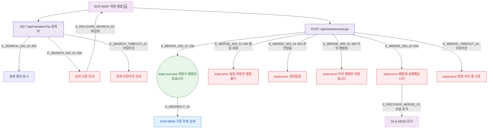

## 1. 목적

SCR-M007에서 발생 가능한 에러 분기와 복구 경로를 명세한다. 🆕 미구현 기능.

## 2. 트리거/전제조건

- SCR-M007 API 호출 실패 발생 시

## 3. 다이어그램

## 4. 엣지 설명

| 엣지 ID | 출발 | 도착 | 조건 |
|---------|------|------|------|
| E_SEARCH_500_01 | 검색 API | 검색 오류 | 500 |
| E_MERGE_400_01 | 병합 API | toast.error | 400 동일 회원 |
| E_MERGE_403_01 | 병합 API | toast.error | 403 권한 없음 |
| E_MERGE_409_01 | 병합 API | toast.error | 409 이미 병합됨 |
| E_MERGE_500_01 | 병합 API | toast.error | 500 |
| E_MERGE_TIMEOUT_01 | 병합 API | toast.error | 타임아웃 |

## 5. TC 후보

| TC ID | 타입 | Given | When | Then |
|-------|------|-------|------|------|
| TC-M007-F8-01 | exception | 검색 API 500 | 회원 검색 | 검색 오류 안내 |
| TC-M007-F8-02 | negative | 동일 회원 병합 시도 | 병합 실행 | toast.error 400 |
| TC-M007-F8-03 | negative | 이미 병합된 회원 | 병합 실행 | toast.error 409 |
| TC-M007-F8-04 | exception | 병합 API 500 | 병합 실행 | toast.error, 모달 유지 |
| TC-M007-F8-05 | exception | 병합 API 타임아웃 | 병합 실행 | toast.error |
