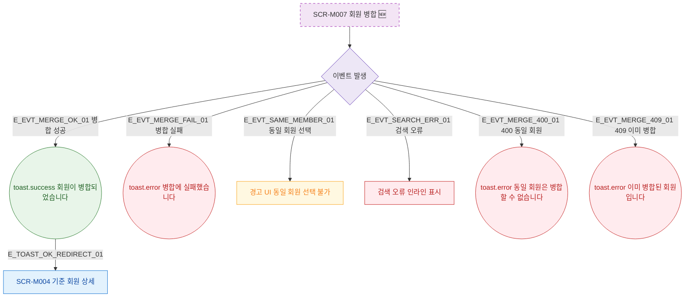

## 1. 목적

SCR-M007에서 발생하는 모든 토스트 메시지와 피드백 조건을 명세한다. 🆕 미구현 기능.

## 2. 트리거/전제조건

- SCR-M007 각 액션 수행 시

## 3. 다이어그램

## 4. 엣지 설명

| 엣지 ID | 출발 | 도착 | 조건 |
|---------|------|------|------|
| E_EVT_MERGE_OK_01 | 이벤트 | toast.success | 병합 성공 |
| E_EVT_MERGE_FAIL_01 | 이벤트 | toast.error | 병합 실패 |
| E_EVT_SAME_MEMBER_01 | 이벤트 | 경고 UI | 동일 회원 선택 |
| E_EVT_MERGE_400_01 | 이벤트 | toast.error | 400 동일 회원 |
| E_EVT_MERGE_409_01 | 이벤트 | toast.error | 409 이미 병합 |
| E_TOAST_OK_REDIRECT_01 | toast.success | 기준 회원 상세 | 자동 이동 |

## 5. TC 후보

| TC ID | 타입 | Given | When | Then |
|-------|------|-------|------|------|
| TC-M007-F9-01 | positive | 병합 성공 | 병합 실행 확인 | toast.success, 기준 회원 상세 이동 |
| TC-M007-F9-02 | negative | 병합 실패 | 병합 실행 | toast.error |
| TC-M007-F9-03 | negative | 동일 회원 선택 | 기준=대상 | 경고 UI 표시 |
| TC-M007-F9-04 | negative | 400 응답 | 병합 실행 | toast.error 동일 회원 불가 |
| TC-M007-F9-05 | negative | 409 응답 | 병합 실행 | toast.error 이미 병합됨 |
