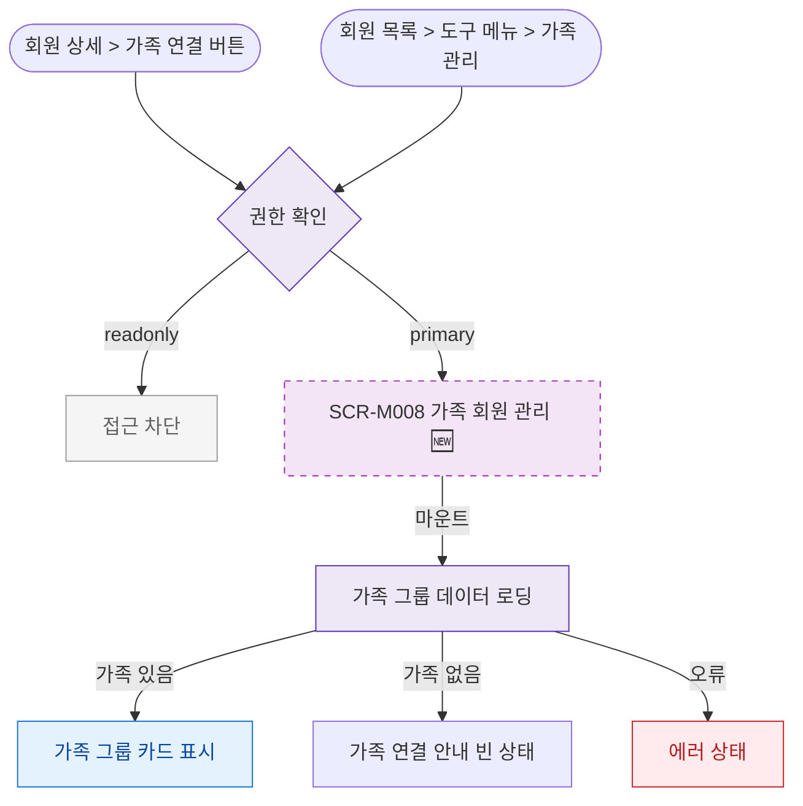

## 1. 목적

SCR-M008 가족 회원 관리 화면에 진입할 수 있는 모든 경로를 명세한다. 🆕 미구현 기능.

## 2. 트리거/전제조건

- 사용자가 로그인 상태이다.

## 3. 다이어그램

## 4. 엣지 설명

| 출발 | 도착 | 조건 | |---------|------|------|------| | | 회원 상세 버튼 | 권한 확인 | 클릭 | | | 회원 목록 메뉴 | 권한 확인 | 클릭 | | | 권한 확인 | 접근 차단 | readonly | | | 권한 확인 | SCR-M008 | 그 외 역할 | | | 로딩 | 가족 그룹 표시 | 데이터 있음 | | | 로딩 | 빈 상태 | 가족 없음 |
