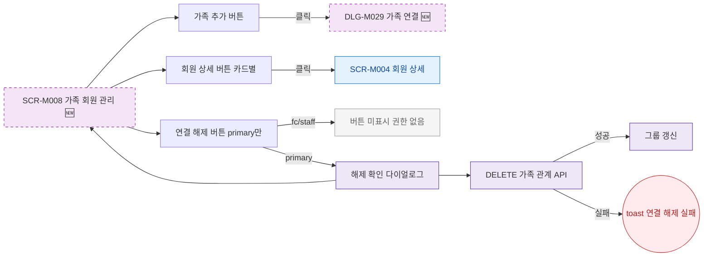

## 1. 목적

SCR-M008의 모든 버튼과 인터랙션 동작을 명세한다. 🆕 미구현 기능.

## 2. 트리거/전제조건

- SCR-M008 렌더링 완료

## 3. 다이어그램

## 4. 엣지 설명

| 출발 | 도착 | 조건 | |---------|------|------|------| | | 가족 추가 버튼 | DLG-M029 | 클릭 | | | 상세 버튼 | SCR-M004 | 클릭 | | | 연결 해제 | 버튼 미표시 | fc/staff | | | 연결 해제 | 해제 확인 | primary | | | 해제 확인 | DELETE API | 확인 | | | DELETE API | toast | 실패 |
