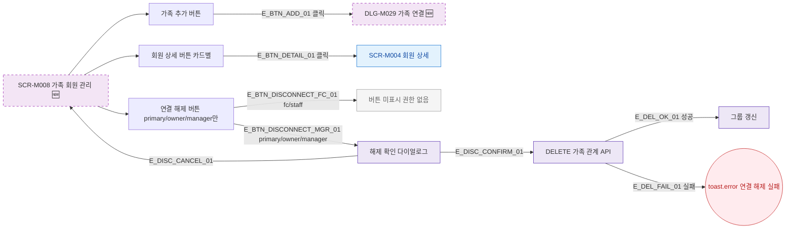

## 1. 목적

SCR-M008의 모든 버튼과 인터랙션 동작을 명세한다. 🆕 미구현 기능.

## 2. 트리거/전제조건

- SCR-M008 렌더링 완료

## 3. 다이어그램

## 4. 엣지 설명

| 엣지 ID | 출발 | 도착 | 조건 |
|---------|------|------|------|
| E_BTN_ADD_01 | 가족 추가 버튼 | DLG-M029 | 클릭 |
| E_BTN_DETAIL_01 | 상세 버튼 | SCR-M004 | 클릭 |
| E_BTN_DISCONNECT_FC_01 | 연결 해제 | 버튼 미표시 | fc/staff |
| E_BTN_DISCONNECT_MGR_01 | 연결 해제 | 해제 확인 | primary/owner/manager |
| E_DISC_CONFIRM_01 | 해제 확인 | DELETE API | 확인 |
| E_DEL_FAIL_01 | DELETE API | toast.error | 실패 |

## 5. TC 후보

| TC ID | 타입 | Given | When | Then |
|-------|------|-------|------|------|
| TC-M008-F3-01 | positive | SCR-M008 | 가족 추가 클릭 | DLG-M029 열림 |
| TC-M008-F3-02 | positive | 가족 카드 | 상세 클릭 | 회원 상세 이동 |
| TC-M008-F3-03 | negative | fc 로그인 | 연결 해제 버튼 | 버튼 미표시 |
| TC-M008-F3-04 | positive | manager | 연결 해제 확인 | 삭제 성공, 갱신 |
| TC-M008-F3-05 | exception | DELETE API 500 | 연결 해제 | toast.error |
