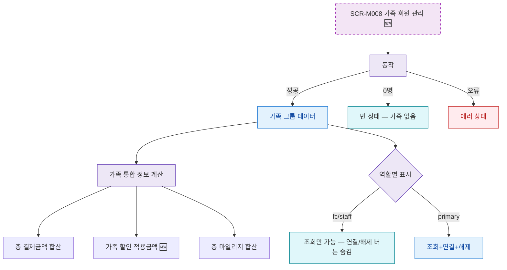

## 1. 목적

SCR-M008의 가족 회원 조회 및 검색 흐름을 명세한다. 🆕 미구현 기능.

## 2. 트리거/전제조건

- SCR-M008 진입 완료

## 3. 다이어그램

## 4. 엣지 설명

| 출발 | 도착 | 조건 | |---------|------|------|------| | | 가족 API | 가족 데이터 | 성공 | | | 가족 API | 빈 상태 | 0명 | | | 가족 API | 에러 상태 | 오류 | | | 역할 필터 | 조회만 | fc/staff | | | 역할 필터 | 전체 액션 | primary |
