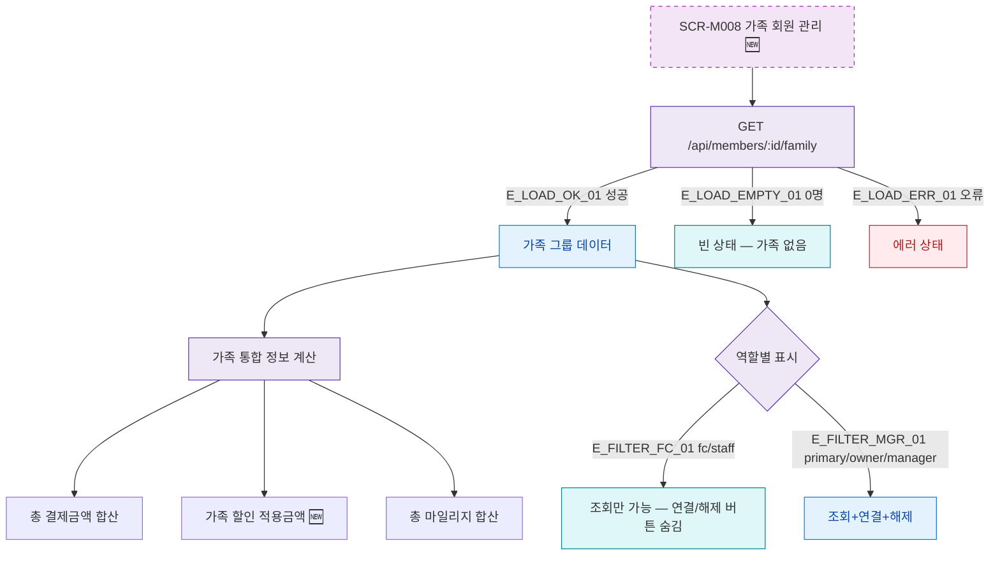

## 1. 목적

SCR-M008의 가족 회원 조회 및 검색 흐름을 명세한다. 🆕 미구현 기능.

## 2. 트리거/전제조건

- SCR-M008 진입 완료

## 3. 다이어그램

## 4. 엣지 설명

| 엣지 ID | 출발 | 도착 | 조건 |
|---------|------|------|------|
| E_LOAD_OK_01 | 가족 API | 가족 데이터 | 성공 |
| E_LOAD_EMPTY_01 | 가족 API | 빈 상태 | 0명 |
| E_LOAD_ERR_01 | 가족 API | 에러 상태 | 오류 |
| E_FILTER_FC_01 | 역할 필터 | 조회만 | fc/staff |
| E_FILTER_MGR_01 | 역할 필터 | 전체 액션 | primary/owner/manager |

## 5. TC 후보

| TC ID | 타입 | Given | When | Then |
|-------|------|-------|------|------|
| TC-M008-F4-01 | positive | 가족 3명 | 화면 로드 | 가족 카드 3개 + 통합 정보 |
| TC-M008-F4-02 | positive | 가족 없음 | 화면 로드 | 빈 상태 안내 |
| TC-M008-F4-03 | positive | fc 로그인 | 화면 로드 | 조회만, 연결/해제 버튼 숨김 |
| TC-M008-F4-04 | positive | manager | 화면 로드 | 연결/해제 버튼 표시 |
