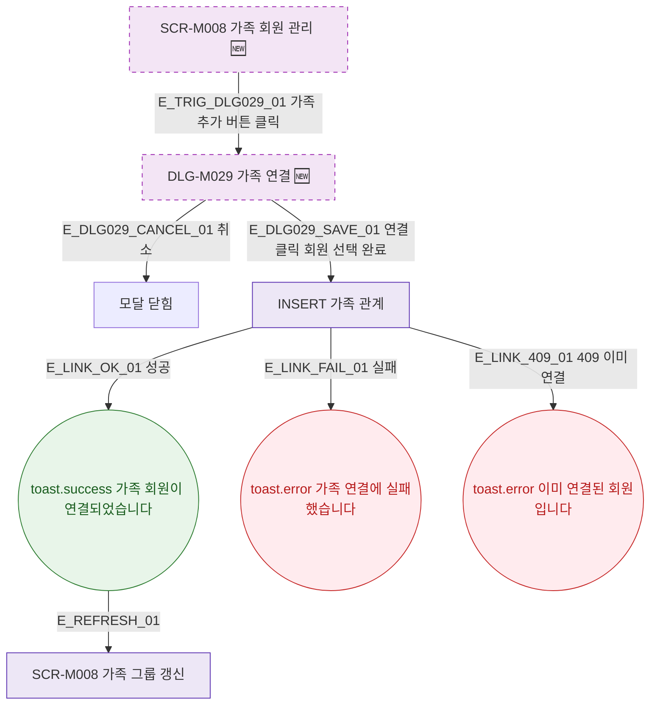

## 1. 목적

SCR-M008에서 열리는 모달의 트리거 경로를 명세한다. 🆕 미구현 기능.

## 2. 트리거/전제조건

- SCR-M008 렌더링 완료, primary/owner/manager 역할

## 3. 다이어그램

## 4. 엣지 설명

| 엣지 ID | 출발 | 도착 | 조건 |
|---------|------|------|------|
| E_TRIG_DLG029_01 | 가족 추가 버튼 | DLG-M029 | 클릭 |
| E_DLG029_CANCEL_01 | DLG-M029 | 모달 닫힘 | 취소 |
| E_DLG029_SAVE_01 | DLG-M029 | INSERT API | 연결 클릭 |
| E_LINK_OK_01 | INSERT API | toast.success | 성공 |
| E_LINK_409_01 | INSERT API | toast.error | 이미 연결됨 |

## 5. TC 후보

| TC ID | 타입 | Given | When | Then |
|-------|------|-------|------|------|
| TC-M008-F5-01 | positive | SCR-M008 | 가족 추가 클릭 | DLG-M029 열림 |
| TC-M008-F5-02 | positive | DLG-M029 | 취소 | 모달 닫힘 |
| TC-M008-F5-03 | positive | DLG-M029 회원+관계 선택 | 연결 클릭 | 성공, 그룹 갱신 |
| TC-M008-F5-04 | negative | 이미 연결된 회원 | 연결 시도 | toast.error 409 |
