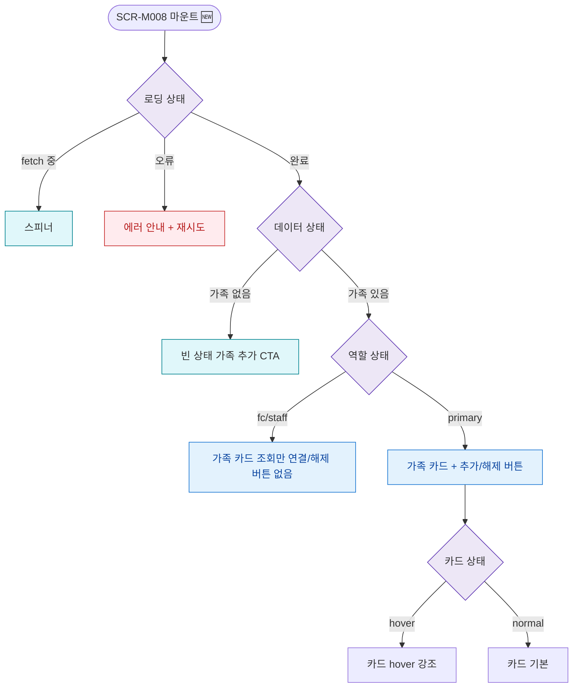

## 1. 목적

SCR-M008의 로딩/빈/에러/역할 상태별 UI 분기를 명세한다. 🆕 미구현 기능.

## 2. 트리거/전제조건

- SCR-M008 마운트 시점

## 3. 다이어그램

## 4. 엣지 설명

| 출발 | 도착 | 조건 | |---------|------|------|------| | | 로딩 상태 | 스피너 | fetch 중 | | | 로딩 상태 | 에러 | 오류 | | | 데이터 상태 | 빈 상태 | 가족 없음 | | | 역할 상태 | 조회만 | fc/staff | | | 역할 상태 | 전체 | primary |
