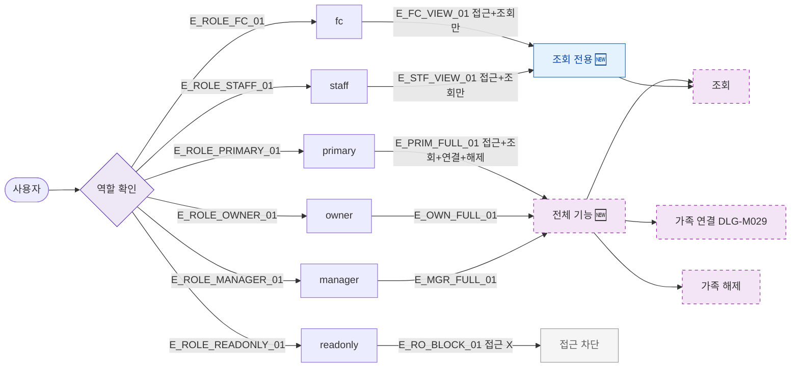

## 1. 목적

SCR-M008에서 역할별 접근 및 액션 범위를 명세한다. 🆕 미구현 기능.

## 2. 트리거/전제조건

- 사용자 로그인 상태

## 3. 다이어그램

## 4. 엣지 설명

| 엣지 ID | 출발 | 도착 | 조건 |
|---------|------|------|------|
| E_PRIM_FULL_01 | primary | 전체 기능 | 허용 |
| E_OWN_FULL_01 | owner | 전체 기능 | 허용 |
| E_MGR_FULL_01 | manager | 전체 기능 | 허용 |
| E_FC_VIEW_01 | fc | 조회 전용 | 연결/해제 불가 |
| E_STF_VIEW_01 | staff | 조회 전용 | 연결/해제 불가 |
| E_RO_BLOCK_01 | readonly | 접근 차단 | 접근 불가 |

## 5. TC 후보

| TC ID | 타입 | Given | When | Then |
|-------|------|-------|------|------|
| TC-M008-F7-01 | positive | manager | 가족 연결 버튼 클릭 | DLG-M029 열림 |
| TC-M008-F7-02 | negative | fc | 가족 연결 버튼 | 버튼 미표시 |
| TC-M008-F7-03 | negative | staff | 가족 해제 버튼 | 버튼 미표시 |
| TC-M008-F7-04 | negative | readonly | SCR-M008 접근 | 접근 차단 |
