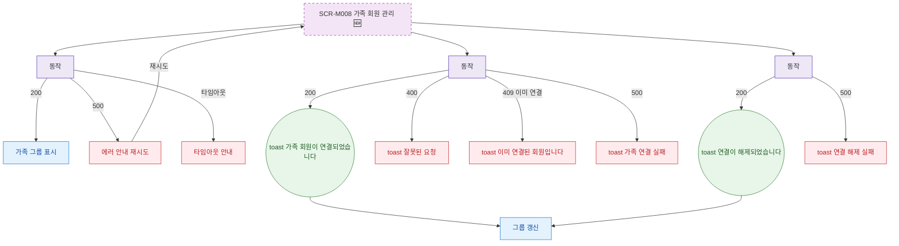

## 1. 목적

SCR-M008의 에러 코드별 분기와 복구 경로를 명세한다. 🆕 미구현 기능.

## 2. 트리거/전제조건

- SCR-M008 API 호출 실패 시

## 3. 다이어그램

## 4. 엣지 설명

| 출발 | 도착 | 조건 | |---------|------|------|------| | | 로드 API | 에러 안내 | 500 | | | 연결 API | toast | 409 이미 연결 | | | 연결 API | toast | 500 | | | 해제 API | toast | 500 |
