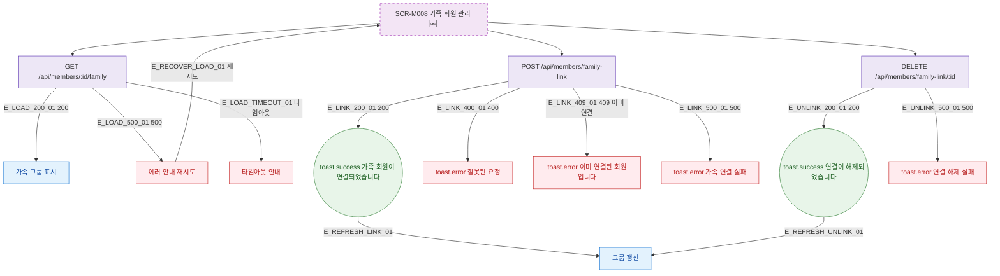

## 1. 목적

SCR-M008의 에러 코드별 분기와 복구 경로를 명세한다. 🆕 미구현 기능.

## 2. 트리거/전제조건

- SCR-M008 API 호출 실패 시

## 3. 다이어그램

## 4. 엣지 설명

| 엣지 ID | 출발 | 도착 | 조건 |
|---------|------|------|------|
| E_LOAD_500_01 | 로드 API | 에러 안내 | 500 |
| E_LINK_409_01 | 연결 API | toast.error | 409 이미 연결 |
| E_LINK_500_01 | 연결 API | toast.error | 500 |
| E_UNLINK_500_01 | 해제 API | toast.error | 500 |

## 5. TC 후보

| TC ID | 타입 | Given | When | Then |
|-------|------|-------|------|------|
| TC-M008-F8-01 | exception | 로드 API 500 | 화면 로드 | 에러 안내 + 재시도 |
| TC-M008-F8-02 | negative | 이미 연결된 회원 | 연결 시도 | toast.error 409 |
| TC-M008-F8-03 | exception | 연결 API 500 | 연결 시도 | toast.error |
| TC-M008-F8-04 | exception | 해제 API 500 | 해제 시도 | toast.error |
