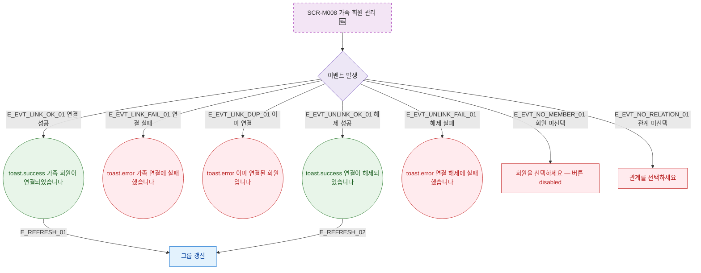

## 1. 목적

SCR-M008에서 발생하는 모든 토스트 메시지와 피드백 조건을 명세한다. 🆕 미구현 기능.

## 2. 트리거/전제조건

- SCR-M008 각 액션 수행 시

## 3. 다이어그램

## 4. 엣지 설명

| 엣지 ID | 출발 | 도착 | 조건 |
|---------|------|------|------|
| E_EVT_LINK_OK_01 | 이벤트 | toast.success | 연결 성공 |
| E_EVT_LINK_FAIL_01 | 이벤트 | toast.error | 연결 실패 |
| E_EVT_LINK_DUP_01 | 이벤트 | toast.error | 이미 연결됨 |
| E_EVT_UNLINK_OK_01 | 이벤트 | toast.success | 해제 성공 |
| E_EVT_NO_MEMBER_01 | 이벤트 | 필드 에러 | 회원 미선택 |

## 5. TC 후보

| TC ID | 타입 | Given | When | Then |
|-------|------|-------|------|------|
| TC-M008-F9-01 | positive | 연결 성공 | 가족 연결 | toast.success, 그룹 갱신 |
| TC-M008-F9-02 | negative | 이미 연결된 회원 | 연결 시도 | toast.error 중복 |
| TC-M008-F9-03 | exception | 연결 API 실패 | 연결 시도 | toast.error |
| TC-M008-F9-04 | positive | 해제 성공 | 연결 해제 | toast.success, 그룹 갱신 |
| TC-M008-F9-05 | negative | 회원 미선택 | 연결 버튼 클릭 | 버튼 disabled |
