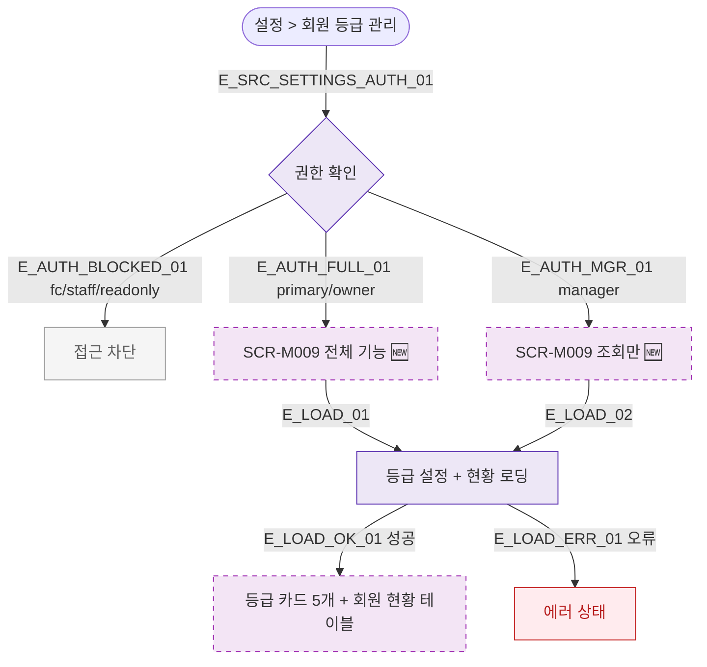

## 1. 목적

SCR-M009 회원 등급 관리 화면 진입 경로를 명세한다. 🆕 미구현 기능.

## 2. 트리거/전제조건

- 사용자 로그인 상태

## 3. 다이어그램

## 4. 엣지 설명

| 엣지 ID | 출발 | 도착 | 조건 |
|---------|------|------|------|
| E_AUTH_BLOCKED_01 | 권한 확인 | 접근 차단 | fc/staff/readonly |
| E_AUTH_MGR_01 | 권한 확인 | 조회만 | manager |
| E_AUTH_FULL_01 | 권한 확인 | 전체 기능 | primary/owner |
| E_LOAD_OK_01 | 로딩 | 등급 카드 표시 | 성공 |
| E_LOAD_ERR_01 | 로딩 | 에러 | 오류 |

## 5. TC 후보

| TC ID | 타입 | Given | When | Then |
|-------|------|-------|------|------|
| TC-M009-F1-01 | positive | owner | 설정 > 등급 관리 | SCR-M009 전체 기능 진입 |
| TC-M009-F1-02 | positive | manager | 설정 > 등급 관리 | SCR-M009 조회만 진입 |
| TC-M009-F1-03 | negative | fc | 접근 시도 | 접근 차단 |
| TC-M009-F1-04 | negative | readonly | 접근 시도 | 접근 차단 |
| TC-M009-F1-05 | exception | API 오류 | 화면 로드 | 에러 상태 |
