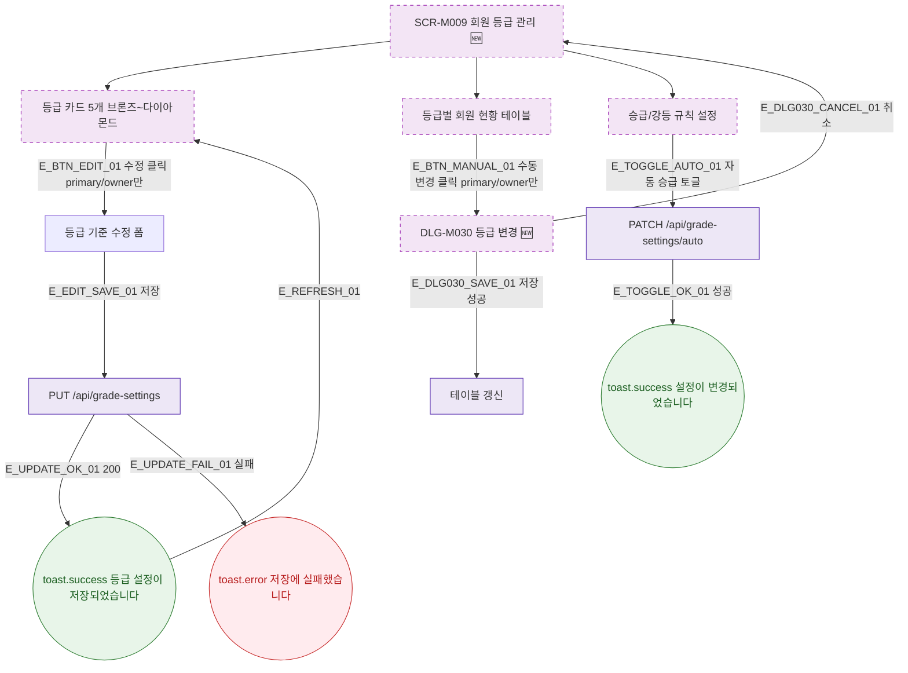

## 1. 목적

SCR-M009의 Happy Path — 등급 설정 조회, 수정, 수동 변경 흐름을 명세한다. 🆕 미구현 기능.

## 2. 트리거/전제조건

- SCR-M009 진입 완료

## 3. 다이어그램

## 4. 엣지 설명

| 엣지 ID | 출발 | 도착 | 조건 |
|---------|------|------|------|
| E_BTN_EDIT_01 | 등급 카드 수정 | 수정 폼 | primary/owner 클릭 |
| E_EDIT_SAVE_01 | 수정 폼 | PUT API | 저장 |
| E_UPDATE_OK_01 | PUT API | toast.success | 200 |
| E_BTN_MANUAL_01 | 수동 변경 | DLG-M030 | 클릭 |
| E_TOGGLE_AUTO_01 | 자동 승급 토글 | PATCH API | 토글 |

## 5. TC 후보

| TC ID | 타입 | Given | When | Then |
|-------|------|-------|------|------|
| TC-M009-F2-01 | positive | owner | 등급 카드 수정 후 저장 | toast.success, 카드 갱신 |
| TC-M009-F2-02 | negative | manager | 수정 버튼 | 버튼 미표시 |
| TC-M009-F2-03 | positive | owner | 수동 변경 클릭 | DLG-M030 열림 |
| TC-M009-F2-04 | positive | owner | 자동 승급 토글 | 설정 변경 토스트 |
| TC-M009-F2-05 | exception | PUT API 500 | 등급 설정 저장 | toast.error |
