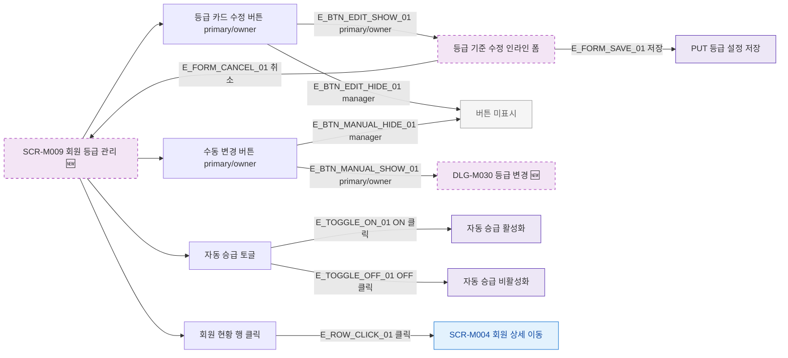

## 1. 목적

SCR-M009의 모든 버튼과 인터랙션을 명세한다. 🆕 미구현 기능.

## 2. 트리거/전제조건

- SCR-M009 렌더링 완료

## 3. 다이어그램

## 4. 엣지 설명

| 엣지 ID | 출발 | 도착 | 조건 |
|---------|------|------|------|
| E_BTN_EDIT_SHOW_01 | 수정 버튼 | 수정 폼 | primary/owner |
| E_BTN_EDIT_HIDE_01 | 수정 버튼 | 미표시 | manager |
| E_BTN_MANUAL_SHOW_01 | 수동 변경 | DLG-M030 | primary/owner |
| E_TOGGLE_ON_01 | 자동 승급 토글 | 활성화 API | ON |
| E_ROW_CLICK_01 | 행 클릭 | SCR-M004 | 클릭 |

## 5. TC 후보

| TC ID | 타입 | Given | When | Then |
|-------|------|-------|------|------|
| TC-M009-F3-01 | positive | owner | 수정 버튼 클릭 | 수정 폼 표시 |
| TC-M009-F3-02 | negative | manager | 수정 버튼 | 미표시 |
| TC-M009-F3-03 | positive | owner | 수동 변경 클릭 | DLG-M030 열림 |
| TC-M009-F3-04 | positive | 자동 승급 OFF | 토글 ON | 자동 승급 활성화 API |
| TC-M009-F3-05 | positive | 회원 행 | 클릭 | SCR-M004 이동 |
