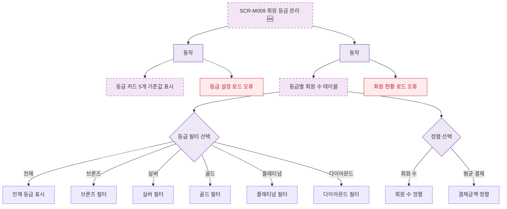

## 1. 목적

SCR-M009의 등급별 회원 현황 테이블 필터 및 조회 흐름을 명세한다. 🆕 미구현 기능.

## 2. 트리거/전제조건

- SCR-M009 데이터 로드 완료

## 3. 다이어그램

## 4. 엣지 설명

| 출발 | 도착 | 조건 | |---------|------|------|------| | | 등급 설정 API | 카드 표시 | 성공 | | | 회원 현황 API | 테이블 표시 | 성공 | | | 등급 필터 | 브론즈 필터 | 선택 | | | 정렬 | 회원 수 정렬 | 선택 |
