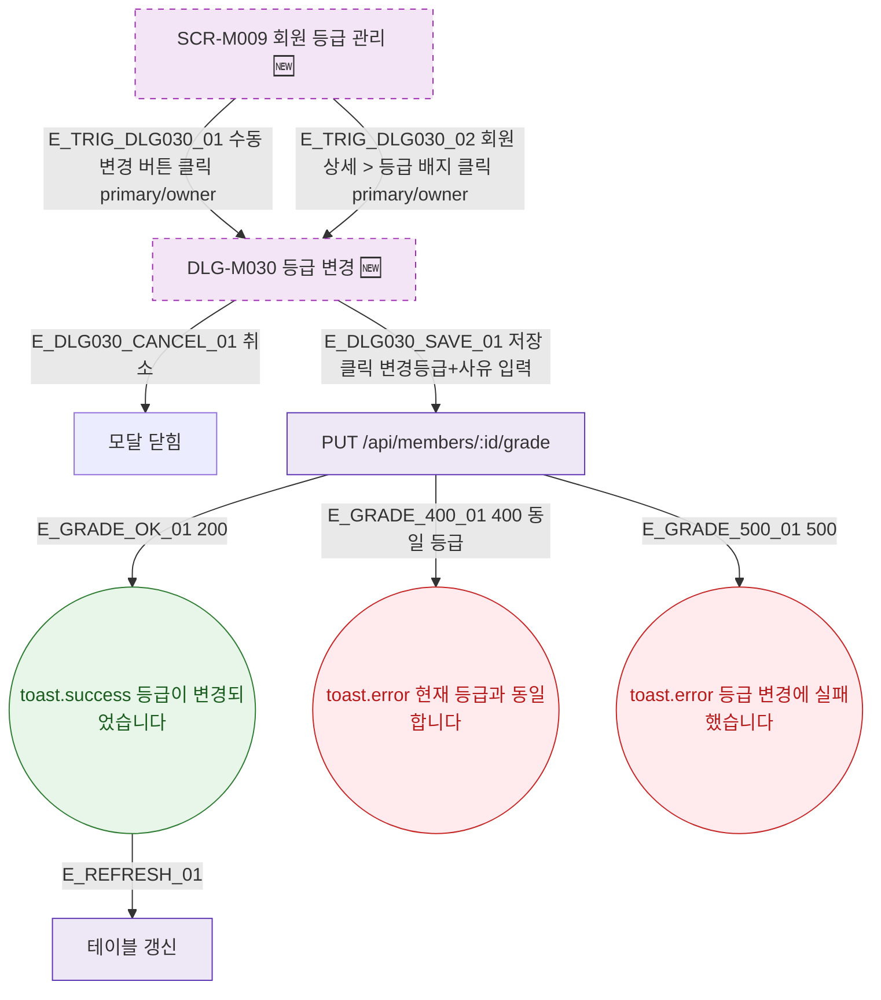

## 1. 목적

SCR-M009에서 열리는 모달의 트리거 경로를 명세한다. 🆕 미구현 기능.

## 2. 트리거/전제조건

- SCR-M009 렌더링 완료, primary/owner 역할

## 3. 다이어그램

## 4. 엣지 설명

| 엣지 ID | 출발 | 도착 | 조건 |
|---------|------|------|------|
| E_TRIG_DLG030_01 | 수동 변경 버튼 | DLG-M030 | primary/owner 클릭 |
| E_TRIG_DLG030_02 | 등급 배지 클릭 | DLG-M030 | 회원 상세에서 |
| E_DLG030_SAVE_01 | DLG-M030 | PUT API | 저장 |
| E_GRADE_400_01 | PUT API | toast.error | 동일 등급 |

## 5. TC 후보

| TC ID | 타입 | Given | When | Then |
|-------|------|-------|------|------|
| TC-M009-F5-01 | positive | owner | 수동 변경 클릭 | DLG-M030 열림 |
| TC-M009-F5-02 | positive | DLG-M030 | 취소 | 모달 닫힘 |
| TC-M009-F5-03 | positive | 다른 등급 선택 + 사유 입력 | 저장 | 등급 변경, 테이블 갱신 |
| TC-M009-F5-04 | negative | 동일 등급 선택 | 저장 | toast.error 400 |
| TC-M009-F5-05 | exception | PUT API 500 | 저장 | toast.error |
