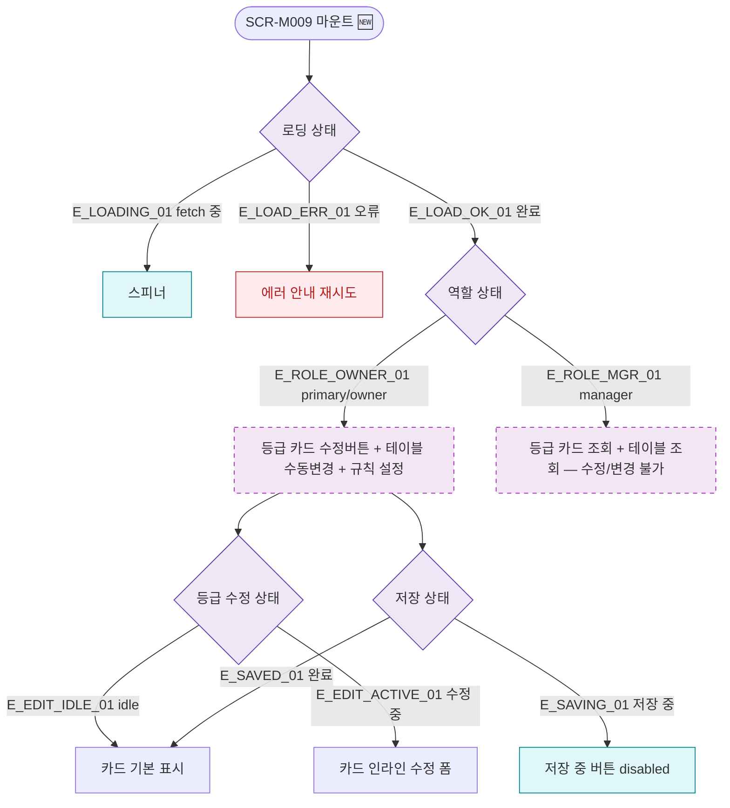

## 1. 목적

SCR-M009의 로딩/에러/역할별 UI 상태 분기를 명세한다. 🆕 미구현 기능.

## 2. 트리거/전제조건

- SCR-M009 마운트

## 3. 다이어그램

## 4. 엣지 설명

| 엣지 ID | 출발 | 도착 | 조건 |
|---------|------|------|------|
| E_LOADING_01 | 로딩 상태 | 스피너 | fetch 중 |
| E_LOAD_ERR_01 | 로딩 상태 | 에러 | 오류 |
| E_ROLE_OWNER_01 | 역할 상태 | 전체 기능 UI | primary/owner |
| E_ROLE_MGR_01 | 역할 상태 | 조회 전용 UI | manager |
| E_EDIT_ACTIVE_01 | 수정 상태 | 인라인 수정 폼 | 수정 중 |
| E_SAVING_01 | 저장 상태 | 저장 중 | 저장 중 |

## 5. TC 후보

| TC ID | 타입 | Given | When | Then |
|-------|------|-------|------|------|
| TC-M009-F6-01 | positive | owner | 화면 로드 | 카드 수정 버튼 표시 |
| TC-M009-F6-02 | positive | manager | 화면 로드 | 수정/변경 버튼 없음 |
| TC-M009-F6-03 | positive | owner | 수정 버튼 클릭 | 인라인 수정 폼 표시 |
| TC-M009-F6-04 | positive | 저장 중 | 저장 버튼 | disabled |
| TC-M009-F6-05 | exception | API 오류 | 화면 로드 | 에러 안내 |
