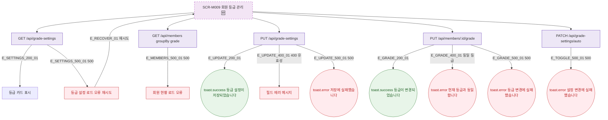

## 1. 목적

SCR-M009의 에러 코드별 분기와 복구 경로를 명세한다. 🆕 미구현 기능.

## 2. 트리거/전제조건

- SCR-M009 API 호출 실패 시

## 3. 다이어그램

## 4. 엣지 설명

| 엣지 ID | 출발 | 도착 | 조건 |
|---------|------|------|------|
| E_SETTINGS_500_01 | 설정 API | 에러 + 재시도 | 500 |
| E_UPDATE_400_01 | 수정 API | 필드 에러 | 400 유효성 |
| E_UPDATE_500_01 | 수정 API | toast.error | 500 |
| E_GRADE_400_01 | 등급 변경 API | toast.error | 동일 등급 |
| E_GRADE_500_01 | 등급 변경 API | toast.error | 500 |

## 5. TC 후보

| TC ID | 타입 | Given | When | Then |
|-------|------|-------|------|------|
| TC-M009-F8-01 | exception | 설정 API 500 | 화면 로드 | 에러 안내 재시도 |
| TC-M009-F8-02 | negative | 유효성 오류 | 등급 설정 저장 | 필드 에러 |
| TC-M009-F8-03 | exception | 수정 API 500 | 등급 설정 저장 | toast.error |
| TC-M009-F8-04 | negative | 동일 등급 선택 | 수동 변경 저장 | toast.error 400 |
| TC-M009-F8-05 | exception | 등급 변경 API 500 | 수동 변경 | toast.error |
