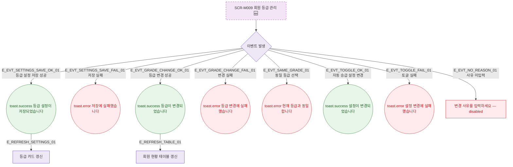

## 1. 목적

SCR-M009에서 발생하는 모든 토스트/피드백 조건을 명세한다. 🆕 미구현 기능.

## 2. 트리거/전제조건

- SCR-M009 각 액션 수행 시

## 3. 다이어그램

## 4. 엣지 설명

| 엣지 ID | 출발 | 도착 | 조건 |
|---------|------|------|------|
| E_EVT_SETTINGS_SAVE_OK_01 | 이벤트 | toast.success | 등급 설정 저장 성공 |
| E_EVT_GRADE_CHANGE_OK_01 | 이벤트 | toast.success | 등급 변경 성공 |
| E_EVT_SAME_GRADE_01 | 이벤트 | toast.error | 동일 등급 |
| E_EVT_NO_REASON_01 | 이벤트 | 필드 에러 | 사유 미입력 |

## 5. TC 후보

| TC ID | 타입 | Given | When | Then |
|-------|------|-------|------|------|
| TC-M009-F9-01 | positive | 유효 설정 저장 | 저장 성공 | toast.success, 카드 갱신 |
| TC-M009-F9-02 | exception | 저장 API 실패 | 저장 시도 | toast.error |
| TC-M009-F9-03 | positive | 다른 등급+사유 | 수동 변경 | toast.success, 테이블 갱신 |
| TC-M009-F9-04 | negative | 동일 등급 | 수동 변경 | toast.error |
| TC-M009-F9-05 | negative | 사유 미입력 | 저장 버튼 | disabled |
